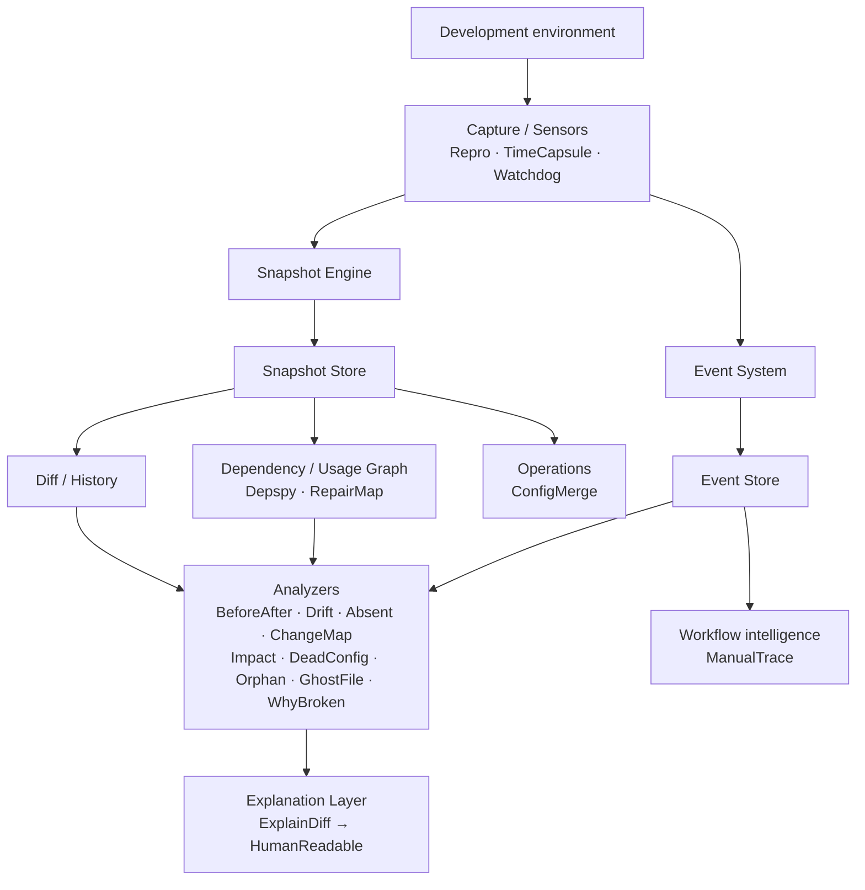

# Architecture

## Overview

Repro is a local-first observability and diagnostic system for development
environments. It makes environment state **observable, reproducible,
comparable, explainable, and traceable over time**.

Design principles:

- **Evidence before explanation** — findings cite concrete artifacts (snapshots,
  events, diffs, graph relations). Narrative layers never invent diagnosis.
- **One snapshot format** — capture modules share a single Snapshot Engine;
  nothing invents a private snapshot schema.
- **Events are not children of snapshots** — `RelatedSnapshotID` is an optional
  reference, not a parent/child relationship.
- **Deterministic analysis** — normalization and hashing produce stable,
  comparable state; analysis avoids hidden nondeterminism.
- **Privacy by default** — secrets and environment variables are not captured
  unless explicitly enabled.

## Data flow



## Layers

| Layer | Packages | Role |
| --- | --- | --- |
| Core domain | `src/core/*` | Snapshot, Event, Entity, Relation, AnalysisResult, errors |
| Snapshot Engine | `src/engine/*` | Collectors, normalize, hash, store, compare |
| Capture | `src/capture/*` | Repro, TimeCapsule, Watchdog |
| Diff & history | `src/analysis/diff`, `src/analysis/history` | Shared comparison / timeline primitives |
| Graph | `src/graph/*` | Depspy, RepairMap, graph store |
| Analysis | `src/analysis/*` | Diagnostic analyzers producing `AnalysisResult` |
| Operations | `src/operations/configmerge` | Config merge + conflict report (not a diagnostic analyzer) |
| Explanation | `src/presentation/*` | ExplainDiff → HumanReadable |
| Intelligence | `src/intelligence/manualtrace` | Optional workflow pattern detection from events |
| CLI / config | `cmd/repro`, `internal/cli`, `internal/config` | Entry point and configuration |

Dependency rule: lower layers must not import higher layers. `src/core` never
imports analysis, presentation, or CLI packages.

## Snapshot vs Event

- A **Snapshot** is an immutable point-in-time capture of environment state
  (content-hashed, parent-linked for history).
- An **Event** records that something happened (file change, command, config
  change, …). Events may optionally reference a snapshot; they are stored and
  queried independently.

Watchdog’s canonical path is: detect change → emit Event → optionally trigger
the Snapshot Engine.

## Analysis contract

Every analyzer returns `src/core/analysis.AnalysisResult`:

- Findings carry severity and confidence as **separate** axes
- Every finding must include diagnostic evidence
- Explanation modules (`ExplainDiff`, `HumanReadable`) only narrate; they do
  not re-run root-cause logic

WhyBroken consumes snapshot history, events, diff, and RepairMap. Time
proximity alone never upgrades a finding to confirmed or likely causality.

## Explanation chain

```
WhyBroken AnalysisResult → ExplainDiff Explanation → HumanReadable Diagnosis
```

Each stage keeps immutable references back to prior IDs and evidence so output
stays traceable.

## Storage

- Snapshots and events support in-memory and filesystem-backed stores
- Content hashing detects silent corruption on load
- Stores must not silently overwrite or discard records

## Privacy boundary

| Collector / input | Default |
| --- | --- |
| OS / runtime / git metadata | Safe to capture |
| Environment variables | Off unless opted in; deny-list always redacts |

See [SECURITY.md](./SECURITY.md) for reporting and threat boundaries.

## Architectural decisions

Design choices are recorded as ADRs under [`docs/adr/`](./docs/adr/). Start
with language/runtime (0001) and core domain contracts (0002), then follow
module ADRs for the layer you are changing.
