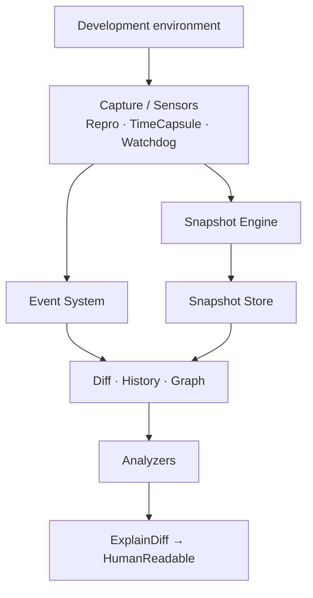

<h1 align="center">REPRO</h1>

<p align="center">
  <em>Local-first observability and diagnostics for development environments</em>
</p>

<p align="center">
  <a href="https://github.com/BaimPriyatna/repro/actions/workflows/ci.yml"></a>
  <a href="LICENSE"></a>
  <a href="go.mod"></a>
  <a href="CHANGELOG.md"></a>
  
</p>

<p align="center">
  Capture state. Compare history. Trace evidence. Explain what broke.<br>
  No cloud required for core diagnosis.
</p>

---

## Highlights

- **Observable snapshots** — one Snapshot Engine shared by Repro, TimeCapsule,
  and Watchdog; content-hashed, immutable, comparable.
- **Events with independent storage** — temporal context without forcing a
  parent/child link to snapshots.
- **Evidence-backed analysis** — findings carry diagnostic evidence; severity
  and confidence stay separate axes.
- **Dependency & usage graph** — Depspy and RepairMap feed impact and root-cause
  analysis.
- **Explanation chain** — WhyBroken → ExplainDiff → HumanReadable, always
  citing prior evidence.
- **Privacy defaults** — environment variables and secrets are off unless you
  opt in.

---

## Quick start

```bash
git clone https://github.com/BaimPriyatna/repro.git
cd repro
go mod tidy
make build
./bin/repro --help
make test
```

Library usage (capture, compare, analyze) is in **[EXAMPLES.md](./EXAMPLES.md)**.
Error codes are documented in **[ERROR-CODES.md](./ERROR-CODES.md)**.

---

## Important

> [!IMPORTANT]
> Repro diagnoses from **local** snapshots, events, diffs, and graph evidence.
> A finding means the evidence supports that conclusion under Repro’s rules —
> it does **not** claim remote monitoring, official verification, or automatic
> repair of your environment. See [ARCHITECTURE.md](./ARCHITECTURE.md) and
> [SECURITY.md](./SECURITY.md).

---

## Table of Contents

- [Highlights](#highlights)
- [Quick start](#quick-start)
- [Important](#important)
- [Architecture](#architecture)
- [Modules (v1)](#modules-v1)
- [Requirements](#requirements)
- [Development](#development)
- [Project Structure](#project-structure)
- [Known Limitations](#known-limitations)
- [Roadmap](#roadmap)
- [Contributing](#contributing)
- [License](#license)

---

## Architecture



- **One snapshot format** — every capture module calls the same engine.
- **Events are peers, not children** of snapshots.
- **Lower layers do not import higher ones** — `src/core` stays free of analysis
  and CLI dependencies.

Full design rationale and layer rules: [ARCHITECTURE.md](./ARCHITECTURE.md).
Decision history: [`docs/adr/`](./docs/adr/).

---

## Modules (v1)

| Area | Modules | Status |
| --- | --- | --- |
| Core | Snapshot, Event, Entity, Relation, AnalysisResult, errors | Library implemented |
| Engine | Collectors, normalizer, hasher, stores, compare | Library implemented |
| Capture | Repro, TimeCapsule, Watchdog | Library implemented |
| Diff / history | Diff, History, BeforeAfter, Drift, Absent, ChangeMap | Library implemented |
| Graph | Depspy, RepairMap | Library implemented |
| Lifecycle / impact | Impact, DeadConfig, Orphan, GhostFile | Library implemented |
| Root cause | WhyBroken | Library implemented |
| Operations | ConfigMerge | Library implemented |
| Explanation | ExplainDiff, HumanReadable | Library implemented |
| Intelligence | ManualTrace | Library implemented |
| CLI | All module subcommands | CLI implemented |
| Storage | Central store with anchor chain, project lifecycle | Storage implemented |

All core functionality ships in **v1.0.0** — library APIs, CLI commands, and multi-project storage.

---

## Requirements

- Go **1.24** or newer
- `make` (optional but recommended)
- [golangci-lint](https://golangci-lint.run/) for local lint (also runs in CI)

---

## Development

```bash
make build      # compile ./bin/repro
make test       # go test -race ./...
make test-v     # verbose tests
make cover      # coverage HTML report
make lint       # golangci-lint
make fmt        # gofmt -w -s
make vet        # go vet
make tidy       # go mod tidy + verify
```

See [`CONTRIBUTING.md`](./CONTRIBUTING.md) for conventions, ADRs, and PR
checklist. Community norms: [`CODE_OF_CONDUCT.md`](./CODE_OF_CONDUCT.md).

---

## Project Structure

```
repro/
├── README.md
├── ARCHITECTURE.md
├── EXAMPLES.md
├── ERROR-CODES.md
├── CHANGELOG.md
├── CONTRIBUTING.md
├── CODE_OF_CONDUCT.md
├── SECURITY.md
├── LICENSE
├── Makefile
├── go.mod
├── cmd/repro/              # CLI entry point
├── internal/
│   ├── cli/                # Cobra root command
│   └── config/             # TOML + env overrides
├── src/
│   ├── core/               # domain types + errors
│   ├── engine/             # snapshot engine
│   ├── capture/            # Repro, TimeCapsule, Watchdog
│   ├── analysis/           # diff, history, analyzers
│   ├── graph/              # Depspy, RepairMap
│   ├── operations/         # ConfigMerge
│   ├── presentation/       # ExplainDiff, HumanReadable
│   └── intelligence/       # ManualTrace
├── docs/
│   ├── VERSIONING.md
│   └── adr/                # Architectural Decision Records
└── .github/
    ├── ISSUE_TEMPLATE/
    ├── PULL_REQUEST_TEMPLATE.md
    └── workflows/ci.yml
```

---

## Known Limitations

- **Collectors** — built-in collectors cover OS, runtime, env (opt-in), and git;
  other environment slices need custom collectors.
- **Env / secrets** — not captured by default; enabling capture is an explicit
  privacy trade-off.
- **WhyBroken explanations** — `ExplainDiff` is scoped to WhyBroken results in
  v1; other analyzers return structured `AnalysisResult` without that narrative
  chain.

For library usage examples, see [EXAMPLES.md](./EXAMPLES.md).

---

## Updates

See [`CHANGELOG.md`](./CHANGELOG.md) for release history.

v1.0.0 includes all 18 core analysis modules, complete CLI with shared flags, central store with multi-project support, and project lifecycle tracking.

Versioning rules: [`docs/VERSIONING.md`](./docs/VERSIONING.md).

---

## Contributing

Bug reports and improvements are welcome. Start with
[`CONTRIBUTING.md`](./CONTRIBUTING.md), and report security issues via
[`SECURITY.md`](./SECURITY.md) rather than a public issue.

---

## License

MIT — see [LICENSE](LICENSE).
