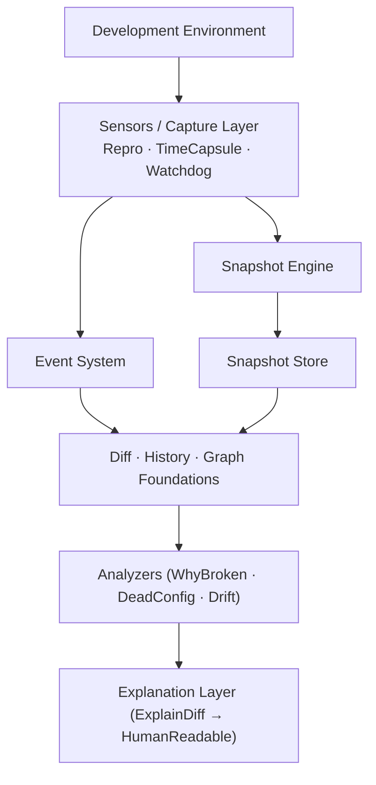

# Architecture

Repro is architected around a strict layered model designed for local-first observability and reproducible diagnostics.

---

## Layered Hierarchy

---

## Architectural Principles

### 1. One Snapshot Format
Every capture module (Repro CLI, TimeCapsule background daemon, Watchdog filesystem trigger) routes through the exact same Snapshot Engine. Snapshots are standardized, normalized, and content-hashed.

### 2. Events as Peers, Not Children
Events do not require an active snapshot parent. Events capture temporal context (such as command execution, package installation, or external signals) as independent first-class entities.

### 3. Strict Upward Dependencies
Lower layers never import higher layers. Specifically:
- `src/core` stays completely free of analysis and CLI imports.
- `src/engine` only depends on `src/core`.
- `src/analysis` depends on `src/core` and `src/engine`, but never on CLI presentation code.
- `internal/cli` wires together lower layers without leaking presentation logic into domain models.

---

## Module Boundaries

| Layer | Packages | Responsibility |
| :--- | :--- | :--- |
| **Domain Core** | `src/core/*` | Immutable types (`Snapshot`, `Event`, `Entity`, `Relation`, `AnalysisResult`), structured error codes |
| **Engine** | `src/engine/*` | Normalized collectors, SHA-256 state hashing, memory/file snapshot stores, canonical comparators |
| **Capture** | `src/capture/*` | Sensors and data collectors for OS environment, Git metadata, runtime versions, and config files |
| **Analysis** | `src/analysis/*` | Diffs, drift calculation, absent entity detection, change mapping, lifecycle tracking (`orphan`, `deadconfig`, `ghostfile`) |
| **Graph** | `src/graph/*` | Dependency and repair graphs (`depspy`, `repairmap`) |
| **Explanation** | `src/presentation/*` | Converting structured findings into human-readable narrative chains backed by forensic evidence |
| **Central Store** | `src/central/*` | Multi-project anchor chain resolution, lifecycle categorization (`active`, `idle`, `dormant`, `abandoned`) |
| **CLI** | `internal/cli/*` | Cobra commands, flag binding, and human/JSON formatting |
