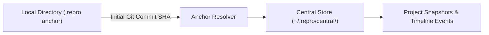

# Snapshots & Events

The snapshot and event system form the foundation of Repro's diagnostic capability.

---

## The Anatomy of a Snapshot

A Snapshot in Repro is an immutable, point-in-time record of environment state. Each snapshot consists of:

- **ID**: Unique deterministic or random identifier (e.g. `snap_01h7x...`).
- **Timestamp**: RFC3339 UTC timestamp of capture.
- **Hash**: SHA-256 cryptographic digest of normalized entities.
- **Metadata**: Capture reason, project anchor, and collector labels.
- **Entities**: Key-value collection of normalized environment components (OS details, runtime binaries, configuration files, git state).

### Content Hashing

Snapshots are hashed deterministically:
1. Collectors gather raw attributes from the host system.
2. Raw attributes are sorted canonically by key name.
3. Values are serialized into standard JSON without whitespace.
4. SHA-256 digest is generated over the canonical stream.

If two environment states are identical, their hashes match exactly, enabling fast comparison and deduplication.

---

## Events System

Events record discrete occurrences along the development timeline without forcing full state captures.

### Structure of an Event

- **ID**: Unique identifier.
- **Timestamp**: When the event occurred.
- **Type**: Category (`tool_execution`, `config_change`, `dependency_update`, `error`).
- **Source**: Originator (`cli`, `watchdog`, `manual_trace`).
- **Payload**: Structured metadata and context.

```json
{
  "id": "ev_01h8a...",
  "timestamp": "2026-10-02T14:10:00Z",
  "type": "dependency_update",
  "source": "npm",
  "payload": {
    "package": "react",
    "previous_version": "18.3.1",
    "new_version": "19.0.0"
  }
}
```

---

## Anchor Chains & Multi-Project Resolution

Repro tracks multiple projects using an **anchor chain**:



When you run commands in a repository:
1. Repro inspects the directory for `.repro` or Git root commit SHA.
2. The probe resolves the project identity against `~/.repro/central/`.
3. If `--local` is passed, Repro isolates all state to the current directory, ignoring central anchors.
