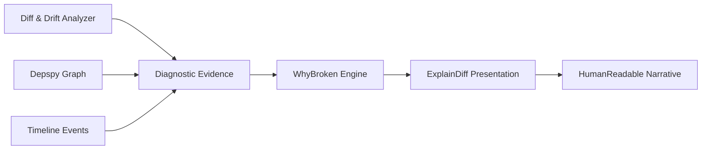

# WhyBroken Diagnostic Chain

The `WhyBroken` diagnostic engine answers the central question of troubleshooting: *"It worked yesterday. What changed and why is it broken now?"*

---

## The Explanation Pipeline

Instead of guessing or providing generic tips, Repro runs an evidence-backed pipeline:



---

## Separate Severity and Confidence Axes

Traditional diagnostic tools conflate severity (how critical the failure is) with confidence (how certain the system is of the root cause). Repro explicitly separates them:

- **Confidence (`0.0` - `1.0`)**: Degree of certainty supported by hard forensic evidence (e.g. 0.95 means an exact breaking commit or direct version conflict was proven).
- **Severity (`LOW`, `MEDIUM`, `HIGH`, `CRITICAL`)**: Operational impact of the detected break.

A finding can be `CRITICAL` severity with `LOW` confidence (alerting the user to check a potential issue without claiming absolute certainty).

---

## Citing Diagnostic Evidence

Every conclusion produced by `WhyBroken` includes an array of `DiagnosticEvidence` references:

```text
Evidence Item:
  Source: Snapshot Diff (snap_prev vs snap_curr)
  Path: package.json / dependencies.esbuild
  Change: 0.19.0 -> 0.21.0
  Impact: Depspy flags incompatible CLI options in build script
```

The `ExplainDiff` module takes these raw evidence items and maps them to a human-readable chain, ensuring complete traceability.
