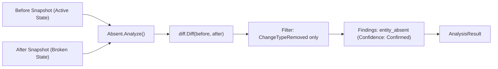

# Absent Analyzer (`src/analysis/absent`)

The **Absent Analyzer** specializes in detecting deleted, missing, or vanished environment entities. It isolates items that were confirmed present in a baseline snapshot but are completely missing in the target snapshot.

---

## Purpose

When builds or scripts fail with errors like `"command not found"`, `"module cannot be loaded"`, or `"file does not exist"`, the problem is almost always an absent entity. While general diff tools report additions, modifications, and deletions intermingled, Absent isolates and highlights disappearances exclusively.

Absent Analyzer is used to:
- Quickly detect missing system binaries, deleted config files, or uninstalled dependencies.
- Provide `ConfidenceConfirmed` findings because entity absence is a deterministic fact verified against snapshot content.
- Serve as high-priority negative evidence during root-cause investigations.

---

## How It Works



1. **Snapshot Diff**: The underlying diff engine calculates changes between `before` and `after`.
2. **Selective Filtering**: Only changes matching `analysis.ChangeTypeRemoved` are retained; additions and modifications are ignored.
3. **Evidence Construction**: For every missing entity, a finding of type `entity_absent` is constructed, capturing:
   - The path of the missing entity.
   - The last known value and attributes from `before.Snapshot`.
   - The timestamp and ID of the snapshot where it was last observed.

---

## Key Types

### `absent.Absent`
The missing-entity analyzer:

```go
const (
    AnalyzerName    = "absent"
    AnalyzerVersion = "1.0.0"

    FindingTypeAbsent = "entity_absent"
)

type Absent struct {
    before *snapshot.Snapshot
    after  *snapshot.Snapshot
}

func New(before, after *snapshot.Snapshot) (*Absent, error)
func (a *Absent) Name() string
func (a *Absent) Version() string
func (a *Absent) Analyze() (*coreanalysis.AnalysisResult, error)
```

---

## Behavior & Rules

- **Zero False Positives**: An `entity_absent` finding is only generated if the key existed in `before.Data` and is strictly missing in `after.Data`.
- **Severity Rating**: Absent findings default to `SeverityMedium` or `SeverityHigh` because missing files/binaries frequently result in catastrophic execution halts.
- **Confirmed Confidence**: Findings carry `coreanalysis.ConfidenceConfirmed` since presence and absence are verifiable facts in normalized snapshot dictionaries.

---

## Limitations

- Absent Analyzer does not tell you *why* an entity was deleted or *who* deleted it. For correlation with shell commands and tool executions, pair Absent findings with the Event System in [WhyBroken](/modules/whybroken).

---

## CLI Command

- [`repro absent`](/cli/analysis#absent) — detect entities missing between snapshots.

```bash
repro absent --from snap_01abc --to snap_01xyz
```

---

## See Also

- [BeforeAfter Analyzer](/modules/beforeafter) — general pairwise state diffing.
- [GhostFile Analyzer](/modules/ghostfile) — tracks file disappearances across longer history and graph usage.
- [WhyBroken](/modules/whybroken) — correlates missing entities with system failures.
