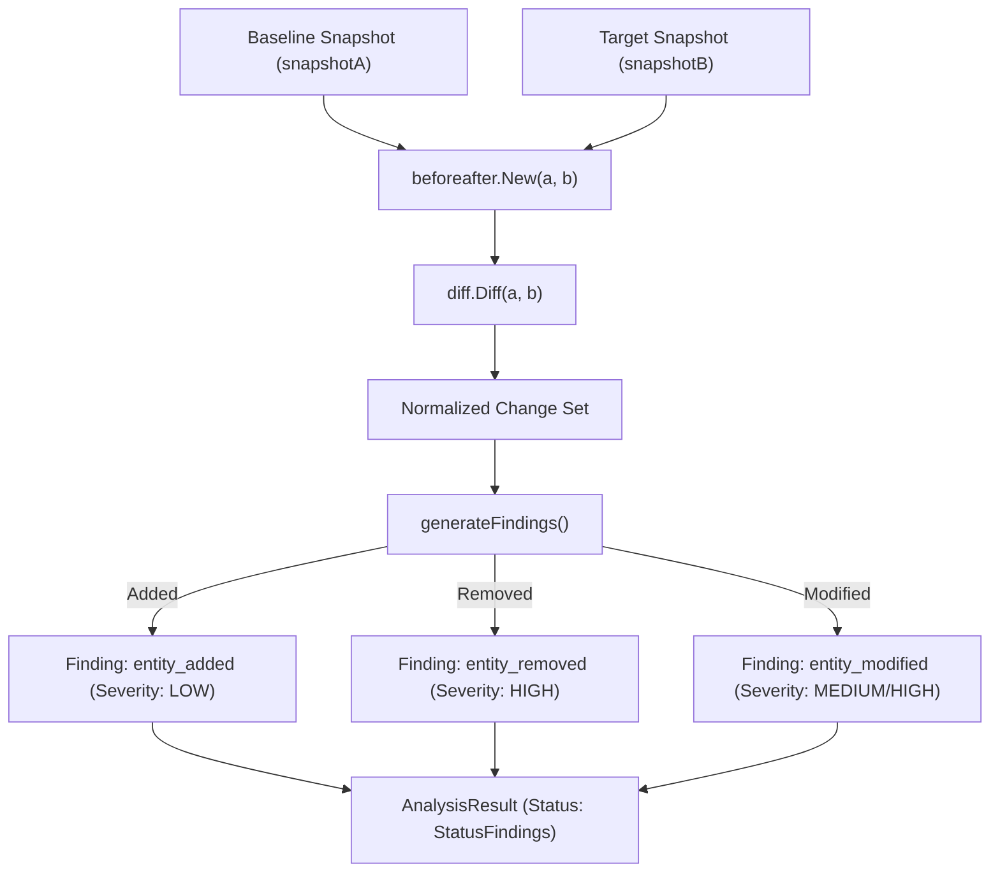

# BeforeAfter Analyzer (`src/analysis/beforeafter`)

The **BeforeAfter** module performs pairwise state analysis between two snapshots. It computes structural differences across normalized environment data, classifies changes into typed findings, and establishes forensic evidence pointers.

---

## Purpose

When troubleshooting an environment failure, developers first ask: *"What changed between when it worked and when it broke?"*

BeforeAfter provides:
- Pairwise comparison between two arbitrary snapshots (baseline vs target).
- Automatic classification of differences into structured findings (`entity_added`, `entity_removed`, `entity_modified`).
- Separation of operational severity from confidence scores.
- Binding of each finding to `DiagnosticEvidence` pointing back to original snapshot hashes.

---

## How It Works



1. **Input Validation**: Both `snapshotA` and `snapshotB` must be non-nil.
2. **Structural Diffing**: The low-level `diff.Diff()` engine compares key-value pairs using canonical JSON representations.
3. **Finding Generation**:
   - `ChangeTypeAdded`: An entity present in B is missing in A (`entity_added`).
   - `ChangeTypeRemoved`: An entity present in A is missing in B (`entity_removed`).
   - `ChangeTypeModified`: An entity exists in both but contains differing values (`entity_modified`).
4. **Evidence Construction**: Each finding records immutable references to the snapshot IDs, fields, and timestamps.
5. **Status Attribution**: If changes are discovered, status is set to `coreanalysis.StatusFindings`; otherwise `coreanalysis.StatusOK`.

---

## Key Types

### `beforeafter.BeforeAfter`
The pairwise analyzer:

```go
const (
    AnalyzerName    = "beforeafter"
    AnalyzerVersion = "1.0.0"
)

type BeforeAfter struct {
    snapshotA *snapshot.Snapshot
    snapshotB *snapshot.Snapshot
}

func New(snapshotA, snapshotB *snapshot.Snapshot) (*BeforeAfter, error)
func (ba *BeforeAfter) Name() string
func (ba *BeforeAfter) Version() string
func (ba *BeforeAfter) Analyze() (*coreanalysis.AnalysisResult, error)
```

### Core Domain Output
```go
type AnalysisResult struct {
    ID               ResultID             `json:"id"`
    Analyzer         string               `json:"analyzer"`
    Version          string               `json:"version"`
    Timestamp        time.Time            `json:"timestamp"`
    Status           ResultStatus         `json:"status"`
    Findings         []Finding            `json:"findings"`
    Evidence         []DiagnosticEvidence `json:"evidence"`
    RelatedSnapshots []snapshot.ID        `json:"related_snapshots"`
}
```

---

## Behavior & Rules

- **Deterministic ID Generation**: The analysis result ID is formatted deterministically as `beforeafter-<snapshotA.ID>-<snapshotB.ID>`.
- **Confidence Guarantee**: Because differences are computed directly from cryptographically hashed snapshots, findings produced by BeforeAfter carry `ConfidenceConfirmed`.
- **Evidence Trail**: Every finding includes two `DiagnosticEvidence` entries referencing both the baseline and target snapshots.

---

## Limitations

- BeforeAfter evaluates exactly two snapshots. It does not analyze historical trends across intermediate snapshots (for multi-snapshot drift, use the [Drift](/modules/drift) analyzer).

---

## CLI Command

- [`repro diff`](/cli/analysis#diff) — execute pairwise snapshot comparison.

```bash
repro diff --from snap_01abc --to snap_01xyz
```

---

## See Also

- [Snapshot Engine](/modules/engine) — snapshot storage and normalization.
- [Drift Analyzer](/modules/drift) — multi-snapshot historical drift analysis.
- [Absent Analyzer](/modules/absent) — dedicated missing-entity detector.
- [WhyBroken](/modules/whybroken) — combines BeforeAfter diffs with events and graph context.
