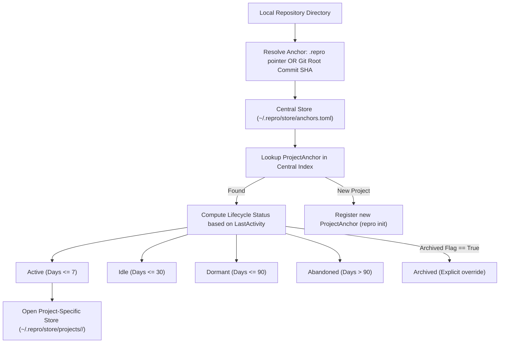

# Central Store & Project Lifecycle (`src/central`)

The **Central Store** manages multi-project repository storage, anchor chain resolution, and developer project lifecycle tracking. It allows Repro to operate seamlessly across dozens of independent repositories while maintaining centralized health metrics, archiving, and dormancy policies.

---

## Purpose

Developers work across multiple git repositories simultaneously. Having isolated `.repro` state scattered across directories makes global auditing, disk cleanup, and machine migration difficult.

Central Store provides:
- Centralized persistence rooted at `~/.repro/store/` (configurable via `--data-dir`).
- Multi-project resolution via directory anchor pointers or Git root commit SHAs.
- Automatic lifecycle tracking (`active` → `idle` → `dormant` → `abandoned` → `archived`).
- Cemetery management for detecting abandoned projects consuming local disk space.
- Clean migration between standalone `--local` mode and central storage.

---

## How It Works



1. **Anchor Resolution**: When a CLI command is run in any directory, Repro looks for a `.repro` anchor file or queries the Git root commit SHA.
2. **Central Index Mapping**: The anchor points to the registered project in `anchors.toml`.
3. **Lifecycle Calculation**: `ComputeStatus()` computes the current state by comparing `time.Now()` against the project's `LastActivity` timestamp using configurable thresholds:
   - `active`: Activity within 7 days (default).
   - `idle`: No activity for 8–30 days.
   - `dormant`: No activity for 31–90 days.
   - `abandoned`: Inactive for > 90 days.
   - `archived`: Explicitly frozen by the developer.
4. **Project Storage Isolation**: Snapshots and events for each project are partitioned into dedicated subdirectories (`projects/<project-name>/`).

---

## Key Types

### `central.CentralStore`
The multi-project store coordinator:

```go
type CentralStore struct {
    rootDir      string
    projectsDir  string
    anchorsFile  string
    anchorsIndex *AnchorsIndex
    mu           sync.RWMutex
}

func NewCentralStore(rootDir string) (*CentralStore, error)
func (cs *CentralStore) RegisterProject(anchor *ProjectAnchor) error
func (cs *CentralStore) LookupProject(nameOrAnchor string) (*ProjectAnchor, error)
func (cs *CentralStore) ListProjects() ([]*ProjectAnchor, error)
func (cs *CentralStore) UpdateProject(anchor *ProjectAnchor) error
func (cs *CentralStore) ForgetProject(name string) error
func (cs *CentralStore) SnapshotStoreFor(projectName string) (store.Store, error)
```

### Lifecycle Enums & Anchor Models
```go
type LifecycleStatus string

const (
    StatusActive    LifecycleStatus = "active"
    StatusIdle      LifecycleStatus = "idle"
    StatusDormant   LifecycleStatus = "dormant"
    StatusAbandoned LifecycleStatus = "abandoned"
    StatusArchived  LifecycleStatus = "archived"
)

type LifecycleThresholds struct {
    ActiveDays  int `toml:"active_days"`
    IdleDays    int `toml:"idle_days"`
    DormantDays int `toml:"dormant_days"`
}

type ProjectAnchor struct {
    Name                string              `toml:"name"`
    RootDir             string              `toml:"root_dir"`
    GitInitCommit       string              `toml:"git_init_commit,omitempty"`
    CreatedAt           time.Time           `toml:"created_at"`
    LastActivity        time.Time           `toml:"last_activity"`
    LifecycleThresholds LifecycleThresholds `toml:"lifecycle_thresholds"`
    Archived            bool                `toml:"archived"`
    SnapshotCount       int                 `toml:"snapshot_count"`
    EventCount          int                 `toml:"event_count"`
}
```

---

## Behavior & Rules

- **Atomic Index Writes**: Updates to `anchors.toml` write to a temporary file (`anchors_*.tmp`) first, followed by an atomic filesystem rename to ensure corruption immunity.
- **Archive Priority**: Setting `Archived: true` overrides all temporal threshold calculations, keeping the project frozen as `StatusArchived`.
- **Standalone Isolation**: When `--local` or `REPRO_STORE_MODE=standalone` is passed, anchor lookup is completely skipped and state is maintained strictly within the current working directory's `.repro/` folder.
- **Non-Destructive Forget**: `repro forget <name>` removes the project from the central index but does **not** erase snapshot data from disk.

---

## Limitations

- Multi-project anchor indexing relies on unique project names or unique initial Git commit SHAs. Moving a project directory without Git initialized requires updating the anchor pointer.

---

## CLI Command

- [`repro init`](/cli/project#init) — initialize tracking and register anchor.
- [`repro list`](/cli/project#list) — list registered projects and status.
- [`repro cemetery`](/cli/project#cemetery) — review dormant and abandoned repositories.
- [`repro set-threshold`](/cli/project#set-threshold) — configure inactivity transition days.
- [`repro migrate-to-central`](/cli/project#migrate-to-central) — migrate `--local` project to central store.

---

## See Also

- [Snapshot Engine](/modules/engine) — underlying persistence engine.
- [Repro Capture](/modules/repro) — project snapshot baseline creation.
- [Core Concepts: Architecture](/concepts/architecture) — central storage topology.
