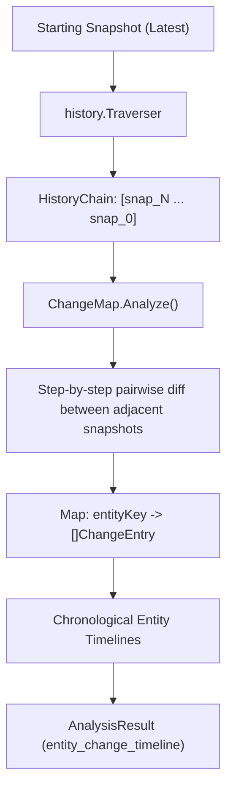

# ChangeMap Analyzer (`src/analysis/changemap`)

The **ChangeMap** module constructs a temporal timeline of entity modifications across an entire snapshot lineage. Rather than summarizing differences into a single aggregate diff, it maps out the chronological progression of every entity from generation to generation.

---

## Purpose

When debugging complex regressions, knowing that a variable changed is often insufficient; you need to understand:
- *When* was this entity first introduced?
- *How frequently* has its value been altered over the last 20 snapshots?
- *Which specific snapshot commit* introduced the breaking change?

ChangeMap creates an indexed, time-ordered audit log for every entity across the snapshot history.

---

## How It Works



1. **Chain Traversal**: Starting from a target snapshot, the analyzer traverses parent links backwards to reconstruct the full historical sequence.
2. **Adjacent Step Diffing**: Pairwise deltas are calculated between each adjacent snapshot pair `(snap_{i}, snap_{i-1})`.
3. **Timeline Grouping**: Changes are indexed by entity key path. Each entry records the snapshot ID, timestamp, transition type (`added`, `modified`, `removed`), old value, and new value.
4. **Structured Presentation**: Generates `entity_change_timeline` findings allowing developers to trace the complete lifecycle of any configuration key or tool.

---

## Key Types

### `changemap.ChangeMap`
The temporal mapping analyzer:

```go
const (
    AnalyzerName    = "changemap"
    AnalyzerVersion = "1.0.0"

    FindingTypeTimeline = "entity_change_timeline"
)

type ChangeEntry struct {
    SnapshotID snapshot.ID       `json:"snapshot_id"`
    Timestamp  time.Time         `json:"timestamp"`
    ChangeType analysis.ChangeType `json:"change_type"`
    OldValue   any               `json:"old_value,omitempty"`
    NewValue   any               `json:"new_value,omitempty"`
}

type EntityTimeline struct {
    EntityKey string        `json:"entity_key"`
    Entries   []ChangeEntry `json:"entries"`
}
```

---

## Behavior & Rules

- **Chronological Ordering**: Entries in each entity's timeline are sorted chronologically from oldest occurrence to newest.
- **Unchanged Entities Skipped**: Entities that remained constant across adjacent snapshots do not create redundant entries, keeping the output compact.
- **Full Lineage Evidence**: The `RelatedSnapshots` list in `AnalysisResult` includes every snapshot visited during the traversal.

---

## Limitations

- Generating change maps across long lineages (e.g. > 50 snapshots with thousands of keys) requires loading multiple snapshots from storage; for fast checks, limit traversal depth via CLI flags.

---

## CLI Command

- [`repro change-map`](/cli/analysis#change-map) — build temporal change map.

```bash
repro change-map --snapshot snap_01xyz
```

---

## See Also

- [Drift Analyzer](/modules/drift) — measures deviation from a single baseline.
- [BeforeAfter Analyzer](/modules/beforeafter) — pairwise two-snapshot diff.
- [Snapshot Engine](/modules/engine) — snapshot storage and history traversal.
