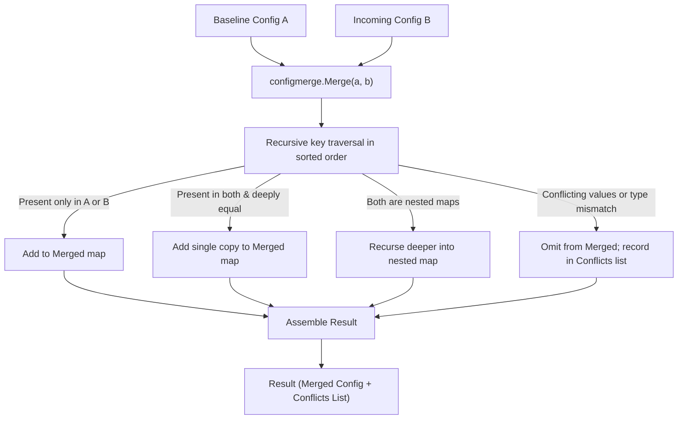

# ConfigMerge (`src/operations/configmerge`)

The **ConfigMerge** module performs semantic, conflict-aware merges of configuration states. It produces a deterministic union of non-conflicting configuration keys while isolating and reporting conflicting values explicitly—guaranteeing that conflicting settings are never silently overwritten.

---

## Purpose

Standard file merge tools (like line-oriented `git merge` or naive dictionary overwrites) frequently fail on configuration files:
- Line-based tools produce syntax errors on reordered JSON keys or misplaced commas.
- Dictionary shallow-merges (`Object.assign`, `dict.update`) silently overwrite existing nested properties, introducing latent configuration bugs.

ConfigMerge solves this by:
- Operating on parsed key-value trees rather than raw text lines.
- Deeply recursing into nested maps.
- Isolating conflicting keys into a structured `Conflicts` list rather than silently picking an arbitrary winner.
- Supporting strict mode to abort automated pipelines upon any configuration ambiguity.

---

## How It Works



1. **Input Normalization**: Both configurations are represented as `map[string]any`. Nil inputs are safely treated as empty maps.
2. **Recursive Traversal**: Keys are sorted lexicographically at every level to guarantee deterministic evaluation.
3. **Conflict Isolation**:
   - `value_mismatch`: Both configurations supply different scalar values for the same dot-separated path (e.g. `port: 8080` vs `port: 9000`).
   - `type_mismatch`: One configuration supplies a scalar and the other supplies a map or list.
4. **Clean Merged Output**: Conflicting paths are completely omitted from the `Merged` output map and appended to `Conflicts` for human or programmatic resolution.

---

## Key Types

### `configmerge.Config` & `configmerge.Result`
The configuration merge types:

```go
type Config map[string]any

const (
    ConflictReasonValueMismatch = "value_mismatch"
    ConflictReasonTypeMismatch  = "type_mismatch"
)

type Conflict struct {
    Path   string `json:"path"`
    ValueA any    `json:"value_a"`
    ValueB any    `json:"value_b"`
    Reason string `json:"reason"`
}

type Result struct {
    Merged    Config     `json:"merged"`
    Conflicts []Conflict `json:"conflicts"`
}

func (r *Result) HasConflicts() bool
func (r *Result) ConflictCount() int
func Merge(a, b Config) (*Result, error)
```

---

## Behavior & Rules

- **Zero Silent Overwrite**: Conflicting keys are never resolved by "last-one-wins". They must either match or be surfaced in `Conflicts`.
- **Deterministic Traversal**: All maps are walked in sorted key order; conflicts are sorted lexicographically by dot-path.
- **Strict Mode**: The CLI `--strict` flag returns an exit code of `2` (`CodeInvalidInput`) if `r.HasConflicts()` evaluates to true.

---

## Limitations

- Lists/slices with differing elements are treated as atomic values rather than recursively diffed; if list contents differ, a `value_mismatch` conflict is raised.

---

## CLI Command

- [`repro config-merge`](/cli/operations#config-merge) — merge configuration files with conflict detection.

```bash
repro config-merge --a config.old.toml --b config.new.toml --strict
```

---

## See Also

- [DeadConfig](/modules/deadconfig) — detects unused configuration keys.
- [BeforeAfter Analyzer](/modules/beforeafter) — compares environment snapshots.
- [Library Overview](/api/overview) — programmatic Go usage.
