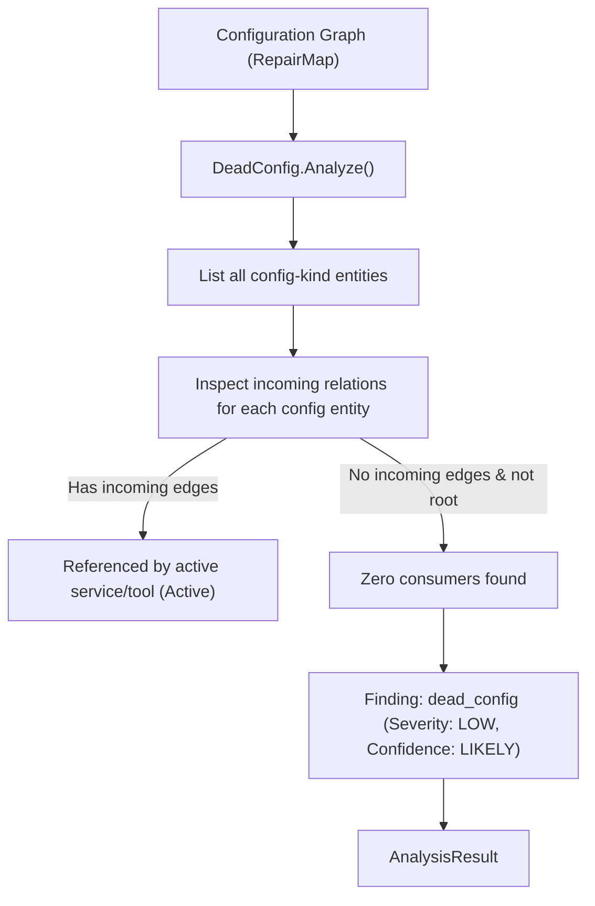

# DeadConfig Analyzer (`src/analysis/deadconfig`)

The **DeadConfig Analyzer** detects stale, unused, and unreferenced configuration keys present in a project's dependency and configuration graph.

---

## Purpose

As projects evolve, configuration files (`.env`, `config.toml`, `settings.json`, build flags) accumulate legacy keys: services are removed, features are retired, or parameters are renamed, but the configuration entries remain.

DeadConfig solves this by:
- Scanning the configuration graph to identify settings that have zero active consumers or incoming relations.
- Preventing developer confusion caused by maintaining configuration options that do nothing.
- Highlighting dead code and configuration bloat across microservices and applications.

---

## How It Works



1. **Entity Filtering**: The analyzer queries the `RepairMap` for all entities categorized as configuration items or environment variables.
2. **Relation Inspection**: For each configuration entity, incoming edges (`depends_on`, `configures`, `reads`) are checked.
3. **Root Protection**: Entities explicitly marked as entrypoints or global application roots are excluded from dead config alerts.
4. **Finding Generation**: Configurations with zero active consumers produce `dead_config` findings with `SeverityLow` and `ConfidenceLikely`.

---

## Key Types

### `deadconfig.DeadConfig`
The configuration orphan detector:

```go
const (
    AnalyzerName    = "deadconfig"
    AnalyzerVersion = "1.0.0"

    FindingTypeDeadConfig = "dead_config"
)

type DeadConfig struct {
    repairMap *repairmap.RepairMap
}

func New(rm *repairmap.RepairMap) (*DeadConfig, error)
func (dc *DeadConfig) Name() string
func (dc *DeadConfig) Version() string
func (dc *DeadConfig) Analyze() (*coreanalysis.AnalysisResult, error)
```

---

## Behavior & Rules

- **Confidence Grading**: Findings carry `ConfidenceLikely` rather than `ConfidenceConfirmed` because configuration keys may occasionally be read dynamically by runtime scripts not captured in static graph manifests.
- **Severity Rating**: Default severity is `SeverityLow` because unused configuration parameters rarely cause hard failures directly, though they introduce maintenance debt.
- **Evidence Linking**: Evidence points to the specific configuration entity ID and key name in the graph store.

---

## Limitations

- DeadConfig relies on graph relations. If a codebase uses dynamic variable interpolation (e.g. `process.env[dynamicKey]`), the consumer relation must be registered in the graph manifest for DeadConfig to see it.

---

## CLI Command

- [`repro dead-config`](/cli/operations#dead-config) — detect unused configuration items.

```bash
repro dead-config --graph ./system-graph.json
```

---

## See Also

- [Orphan Analyzer](/modules/orphan) — broader detector for any unreferenced resource type.
- [ConfigMerge](/modules/configmerge) — semantic, conflict-aware configuration merge engine.
- [RepairMap](/modules/repairmap) — graph index and relation queries.
