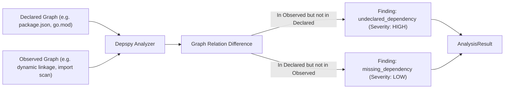

# Depspy (`src/graph/depspy`)

The **Depspy** module detects hidden, undeclared, and phantom dependencies. By cross-referencing a project's *declared* dependency manifest against its *observed* runtime dependency graph, Depspy surfaces discrepancies that lead to "works on my machine" bugs.

---

## Purpose

Software projects frequently fail in CI or production because code relies on packages installed globally, transitive dependencies pulled in by other tools, or ambient system libraries that are never declared in `package.json`, `go.mod`, or requirements manifests.

Depspy solves this by:
- Comparing declared relations against observed runtime dependencies.
- Identifying **undeclared dependencies**: libraries imported or linked by code but missing from manifests.
- Identifying **missing/phantom dependencies**: libraries declared in manifests but never actually used or resolved by the runtime.
- Producing structured `AnalysisResult` findings with forensic evidence pointers.

---

## How It Works



1. **Graph Ingestion**: Two graph structures are provided: the *Declared Graph* and the *Observed Graph*.
2. **Edge Comparison**:
   - Each directed edge `(A -> B)` in the observed graph is verified against declared relations.
   - If an edge exists in the observed graph without a corresponding declared relation, an `undeclared_dependency` finding is generated.
   - If an edge is declared in the manifest but has zero active occurrences in the observed graph, a `missing_dependency` finding is generated.
3. **Evidence Attachment**: Every finding is backed by `DiagnosticEvidence` pointing to the exact entity IDs and relation names.

---

## Key Types

### `depspy.Depspy`
The dependency analysis runner:

```go
const (
    AnalyzerName    = "depspy"
    AnalyzerVersion = "1.0.0"

    FindingTypeUndeclared = "undeclared_dependency"
    FindingTypeMissing    = "missing_dependency"
)

type Depspy struct {
    declaredGraph *graph.Graph
    observedGraph *graph.Graph
}

func New(declared, observed *graph.Graph) (*Depspy, error)
func (d *Depspy) Name() string
func (d *Depspy) Version() string
func (d *Depspy) Analyze() (*coreanalysis.AnalysisResult, error)
```

### Graph JSON Representation
The standard schema consumed by Depspy CLI and library:

```json
{
  "entities": [
    { "id": "my-app", "kind": "application", "name": "my-app" },
    { "id": "react", "kind": "library", "name": "react" },
    { "id": "lodash", "kind": "library", "name": "lodash" }
  ],
  "relations": [
    { "from": "my-app", "to": "react", "type": "depends_on" },
    { "from": "my-app", "to": "lodash", "type": "depends_on" }
  ]
}
```

---

## Behavior & Rules

- **Strict Validation**: Both declared and observed graphs must be non-nil; otherwise `analysis.ErrInvalidInput` is returned.
- **Evidence Trail**: Findings carry `coreanalysis.EvidenceKindGraph` referencing the offending entity identifiers.
- **Severity Mapping**:
  - `undeclared_dependency` carries `SeverityHigh` because missing declarations regularly cause build failures on clean checkouts.
  - `missing_dependency` carries `SeverityLow` as it usually represents harmless manifest bloat or lazy loading.

---

## Limitations

- Depspy analyzes graph entities and relations. It relies on manifest parsers and AST/linker sensors to supply the declared and observed graph JSON files.

---

## CLI Command

- [`repro deps`](/cli/analysis#deps) — compare declared vs observed graphs.

```bash
repro deps --declared ./manifest-graph.json --observed ./runtime-graph.json
```

---

## See Also

- [RepairMap](/modules/repairmap) — graph query engine and dependents traversal.
- [Impact Analyzer](/modules/impact) — calculate blast radius of dependency modifications.
- [WhyBroken](/modules/whybroken) — correlates dependency breaks with state changes.
