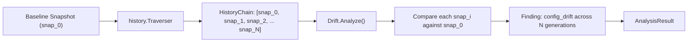

# Drift Analyzer (`src/analysis/drift`)

The **Drift Analyzer** detects gradual, progressive environment deviation away from a known baseline snapshot across a multi-generation snapshot lineage.

---

## Purpose

Unlike sudden breaking changes detected by pairwise diffing, configuration drift often accumulates silently across dozens of minor changes: a developer tweaks a local port, a package manager updates a patch version, or an environment variable is changed temporarily and forgotten. Over time, the local environment drifts far from the initial clean state.

Drift Analyzer solves this by:
- Traversing the lineage chain forward from an initial baseline snapshot.
- Quantifying how many generations a key has drifted and how many times it was mutated.
- Surfacing cumulative drift across the entire timeline rather than just single-step deltas.

---

## How It Works



1. **Lineage Traversal**: The `history.Traverser` walks parent pointers starting from the baseline snapshot up to a bounded depth (default: `10` snapshots).
2. **Sequential Comparison**: Each subsequent snapshot in the chain (`chain.Snapshots[1..N]`) is compared back to the original baseline (`chain.Snapshots[0]`).
3. **Cumulative Metrics**: The analyzer tracks:
   - When a key first deviated from the baseline value.
   - The total number of snapshots in which the drifted value persisted.
4. **Finding Assembly**: Generates `config_drift` findings with `SeverityMedium` or `SeverityHigh` depending on deviation persistence.

---

## Key Types

### `drift.Drift`
The multi-snapshot drift analyzer:

```go
const (
    AnalyzerName    = "drift"
    AnalyzerVersion = "1.0.0"

    FindingTypeDrift = "config_drift"
)

type Drift struct {
    baseline  *snapshot.Snapshot
    chain     *analysis.HistoryChain
    traverser *history.Traverser
}

func New(baseline *snapshot.Snapshot, traverser *history.Traverser) (*Drift, error)
func (d *Drift) Name() string
func (d *Drift) Version() string
func (d *Drift) Analyze() (*coreanalysis.AnalysisResult, error)
```

### Lineage Query Contract
```go
type HistoryQuery struct {
    StartID      snapshot.ID
    IncludeStart bool
    MaxDepth     int
}
```

---

## Behavior & Rules

- **Baseline Anchor**: All comparisons are anchored strictly to `baseline.Snapshot`; intermediate oscillations that return to baseline values are marked as reconciled.
- **Related Snapshots**: The `RelatedSnapshots` array in the resulting `AnalysisResult` lists all snapshot IDs evaluated during the traversal.
- **Evidence Binding**: Diagnostic evidence cites both the baseline snapshot hash and the first descendant snapshot where the drift was introduced.

---

## Limitations

- Requires snapshots to have valid `ParentID` links. If snapshots were captured without parent pointers, lineage traversal cannot proceed past the starting snapshot.

---

## CLI Command

- [`repro drift`](/cli/analysis#drift) — analyze configuration drift from baseline.

```bash
repro drift --from snap_01abc
```

---

## See Also

- [BeforeAfter Analyzer](/modules/beforeafter) — pairwise snapshot diff.
- [ChangeMap](/modules/changemap) — temporal timeline mapping across lineage.
- [WhyBroken](/modules/whybroken) — root-cause engine incorporating drift evidence.
