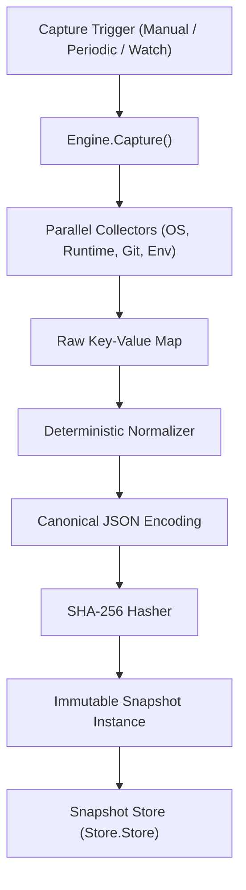

# Snapshot Engine (`src/engine`)

The **Snapshot Engine** is the core operational substrate of Repro. It coordinates environment data collection across parallel sensors, normalizes heterogeneous data deterministically, computes cryptographic content digests, persists snapshots to storage backends, and calculates canonical state comparisons.

---

## Purpose

Different capture mechanisms in Repro (manual one-shot commands, the TimeCapsule daemon, and the Watchdog trigger) require a single, unified engine to guarantee that state representations remain consistent, immutable, and comparable across all workflows.

The Snapshot Engine ensures:
- All environment captures produce identical schemas and serialization regardless of the invoking sensor.
- Snapshots are content-addressed and cryptographically verifiable.
- Data structures are normalized to prevent false diffs caused by map key reordering or numeric serialization discrepancies.

---

## How It Works



1. **Parallel Collection**: The engine executes configured collectors concurrently within goroutines, collecting subsystem slices into an aggregated data dictionary.
2. **Deterministic Normalization**: Arbitrary nested maps, slices, and primitives are canonicalized (keys sorted lexicographically, integers unified to float64, structures marshaled to canonical forms).
3. **Cryptographic Hashing**: The normalized representation is encoded into whitespace-free canonical JSON and digested with SHA-256. This content hash serves as an integrity check and deduplication anchor.
4. **Storage & Comparison**: The resulting `Snapshot` is persisted into a pluggable `Store` backend. When comparing two snapshots, identical content hashes short-circuit comparison to zero drift in O(1) time.

---

## Key Types

### `engine.Engine`
The central manager coordinating capture, persistence, and diff operations:

```go
type Engine struct {
    store      store.Store
    hasher     hasher.Hasher
    collectors map[string]collector.Collector
    normalizer normalizer.Normalizer
}

func (e *Engine) Capture(ctx context.Context, source snapshot.Source, opts ...CaptureOption) (*snapshot.Snapshot, error)
func (e *Engine) Store(ctx context.Context, snap *snapshot.Snapshot) error
func (e *Engine) Compare(a, b *snapshot.Snapshot) (*Comparison, error)
```

### `store.Store`
The storage abstraction implemented by both file-backed and in-memory persistence engines:

```go
type Store interface {
    Store(ctx context.Context, snap *snapshot.Snapshot) error
    Load(ctx context.Context, id snapshot.ID) (*snapshot.Snapshot, error)
    List(ctx context.Context, filter Filter) ([]*snapshot.Snapshot, error)
    ListMetadata(ctx context.Context, filter Filter) ([]Metadata, error)
    Delete(ctx context.Context, id snapshot.ID) error
    Exists(ctx context.Context, id snapshot.ID) (bool, error)
}
```

### `engine.Comparison`
The structural delta result between two snapshots:

```go
type Comparison struct {
    BaseID        snapshot.ID        `json:"base_id"`
    TargetID      snapshot.ID        `json:"target_id"`
    Identical     bool               `json:"identical"`
    AddedKeys     []string           `json:"added_keys"`
    RemovedKeys   []string           `json:"removed_keys"`
    ModifiedKeys  []string           `json:"modified_keys"`
    UnchangedKeys []string           `json:"unchanged_keys"`
    DiffDetails   map[string]KeyDiff `json:"diff_details,omitempty"`
}
```

---

## Behavior & Rules

- **Deterministic Serialization**: If two environment scans collect identical keys and values, they are guaranteed to produce identical SHA-256 `ContentHash` strings.
- **Fail-Safe Integrity**: `Store.Load()` recalculates the content hash from loaded entities. If disk corruption or tampering is detected, it returns `REPRO_STORAGE_FAILURE` instead of serving damaged state.
- **Atomic Persistence**: File store operations write snapshots to temporary files first (`snap_*.tmp`) before performing an atomic filesystem rename to prevent partial writes.
- **Privacy Enforcement**: The environment collector redacts sensitive tokens and excludes environment variables by default unless explicitly allowed.

---

## Limitations

- In-memory stores (`store.NewMemStore()`) do not persist data across process termination.
- Custom collectors must return JSON-serializable values; unsupported pointer graphs are flattened via standard JSON reflection.

---

## CLI Command

- [`repro capture`](/cli/capture#capture) — capture a new environment snapshot.
- [`repro snapshot`](/cli/capture#snapshot) — inspect, list, and compare stored snapshots.

---

## See Also

- [Repro Capture](/modules/repro) — one-shot manual capture wrapper.
- [TimeCapsule](/modules/timecapsule) — daemon for automated periodic snapshot capture.
- [Watchdog](/modules/watchdog) — event-driven reactive capture trigger.
- [Core Concepts: Snapshots](/concepts/snapshots) — architectural overview of snapshots and events.
