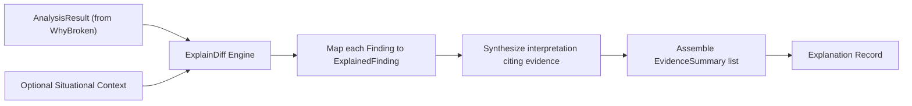

# ExplainDiff (`src/presentation/explaindiff`)

The **ExplainDiff** module bridges raw analytical findings with human interpretation. It converts the structured `AnalysisResult` produced by WhyBroken into an evidence-cited `Explanation` record without re-running diagnostic logic or inventing unsupported assertions.

---

## Purpose

Machine-generated findings (JSON objects with severity enum flags and evidence arrays) are ideal for automation pipelines, but difficult for developers to quickly comprehend during an active incident.

ExplainDiff provides:
- Synthesis of raw findings into structured `ExplainedFinding` entries.
- Context injection: embedding situational context (e.g. *"CI failed after merging PR #42"*) directly into the diagnostic record.
- Generating deterministic interpretations that strictly quote and cite prior evidence items.
- Full auditability: maintaining immutable back-references to source `FindingID` and `DiagnosticEvidence` IDs.

---

## How It Works



1. **Input Ingestion**: Accepts a pre-computed `*coreanalysis.AnalysisResult` and an optional string context.
2. **Finding Interpretation**: Each finding is transformed into an `ExplainedFinding`. An interpretation string is generated based on finding type, severity, and evidence values.
3. **Evidence Summarization**: Raw evidence references (`EvidenceKindSnapshot`, `EvidenceKindGraph`, `EvidenceKindEvent`) are projected into lightweight `EvidenceSummary` objects.
4. **Immutable Association**: The resulting `Explanation` contains the original `AnalysisResultID`, ensuring that human-readable summaries can always be audited against raw mathematical results.

---

## Key Types

### `explaindiff.ExplainDiff`
The explanation builder:

```go
type ExplainDiff struct {
    result  *coreanalysis.AnalysisResult
    context string
}

func New(result *coreanalysis.AnalysisResult, opts ...Option) (*ExplainDiff, error)
func WithContext(ctx string) Option
func (ed *ExplainDiff) Explain() (*Explanation, error)
```

### `explaindiff.Explanation` & `explaindiff.ExplainedFinding`
The structured output types:

```go
type Explanation struct {
    ID               string             `json:"id"`
    AnalysisResultID coreanalysis.ResultID `json:"analysis_result_id"`
    Context          string             `json:"context,omitempty"`
    Timestamp        time.Time          `json:"timestamp"`
    Findings         []ExplainedFinding `json:"findings"`
}

type ExplainedFinding struct {
    FindingID      coreanalysis.FindingID    `json:"finding_id"`
    Severity       coreanalysis.Severity     `json:"severity"`
    Confidence     coreanalysis.Confidence   `json:"confidence"`
    Type           string                    `json:"type"`
    Subject        entity.ID                 `json:"subject"`
    Interpretation string                    `json:"interpretation"`
    Evidence       []EvidenceSummary         `json:"evidence"`
}

type EvidenceSummary struct {
    Kind      coreanalysis.EvidenceKind `json:"kind"`
    SourceID  string                    `json:"source_id"`
    Field     string                    `json:"field,omitempty"`
    Value     any                       `json:"value,omitempty"`
    Timestamp time.Time                 `json:"timestamp"`
}
```

---

## Behavior & Rules

- **No Diagnostic Re-execution**: ExplainDiff is strictly a presentation layer. It does not re-query stores, recalculate hashes, or modify confidence scores.
- **Evidence Integrity**: Interpretations must only cite facts explicitly present in the input `AnalysisResult`. If evidence is missing, the interpretation notes the absence rather than guessing.
- **Referential Traceability**: Every `ExplainedFinding` retains its original `FindingID`.

---

## Limitations

- In v1, ExplainDiff is optimized primarily for `WhyBroken` analysis results; other analyzers produce direct `AnalysisResult` records without the narrative interpretation chain.

---

## CLI Command

- [`repro explain-diff`](/cli/operations#explain-diff) — produce structured explanation from findings.

```bash
repro explain-diff --result ./analysis-result.json --context "Deploy failed on node 3"
```

---

## See Also

- [WhyBroken](/modules/whybroken) — upstream diagnostic analyzer.
- [HumanReadable](/modules/humanreadable) — renders explanations into plain language text.
- [Core Concepts: WhyBroken Chain](/concepts/why-broken) — narrative pipeline architecture.
