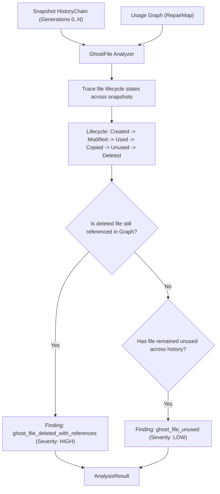

# GhostFile Analyzer (`src/analysis/ghostfile`)

The **GhostFile Analyzer** tracks the full lifecycle of files across snapshot history and dependency usage graphs. It identifies files that were deleted or dropped in historical snapshots but still linger in build outputs, caches, or dangling graph references.

---

## Purpose

A frequent source of bizarre build failures is a file that was deleted from source control but whose compiled output (e.g. `dist/legacy-bundle.js`, `.cache/old-transform.json`, or stale native `.so`/`.dylib` bindings) remains on disk or continues to be referenced by other modules.

GhostFile solves this by combining:
- **Snapshot History**: Verifying when a file was created, modified, and subsequently deleted.
- **Usage Graph**: Detecting whether other entities in the system still maintain active dependencies on the deleted path.

---

## How It Works



1. **History Ingestion**: A pre-traversed `HistoryChain` provides the chronological sequence of snapshots.
2. **Lifecycle State Machine**: Each file entity is traced through its discrete lifecycle transitions:
   `Created` → `Modified` → `Used` → `Copied` → `Unused` → `Deleted`.
3. **Graph Cross-Check**: If a file was deleted in recent snapshots but the `RepairMap` still contains active dependency relations pointing to it, a high-severity `ghost_file_deleted_with_references` finding is triggered.
4. **Cache & Orphan Detection**: Files dropped from source trees that persist only in cache directories generate lifecycle drift warnings.

---

## Key Types

### `ghostfile.GhostFile`
The file lifecycle analyzer:

```go
const (
    AnalyzerName    = "ghostfile"
    AnalyzerVersion = "1.0.0"

    FindingTypeUnused                = "ghost_file_unused"
    FindingTypeCopied                = "ghost_file_copied"
    FindingTypeDeletedWithReferences = "ghost_file_deleted_with_references"
    FindingTypeLifecycle             = "ghost_file_lifecycle"
)

type LifecycleState string

const (
    StateCreated  LifecycleState = "created"
    StateModified LifecycleState = "modified"
    StateUsed     LifecycleState = "used"
    StateCopied   LifecycleState = "copied"
    StateUnused   LifecycleState = "unused"
    StateDeleted  LifecycleState = "deleted"
)

type FileInfo struct {
    Path     string
    Hash     string
    Snapshot snapshot.ID
    EntityID entity.ID
}

type GhostFile struct {
    repairMap *repairmap.RepairMap
    chain     *analysis.HistoryChain
}

func New(rm *repairmap.RepairMap, chain *analysis.HistoryChain) (*GhostFile, error)
func NewWithTraverser(rm *repairmap.RepairMap, start *snapshot.Snapshot, traverser *history.Traverser, maxDepth int) (*GhostFile, error)
func (gf *GhostFile) Name() string
func (gf *GhostFile) Version() string
func (gf *GhostFile) Analyze() (*coreanalysis.AnalysisResult, error)
```

---

## Behavior & Rules

- **Multi-Sensor Fusion**: GhostFile is uniquely capable of cross-layer analysis because it simultaneously consumes the time-series snapshot store and the topological graph store.
- **Severity Escalation**: While an unused file (`ghost_file_unused`) is rated `SeverityLow`, a file deleted from Git but referenced in a build script (`ghost_file_deleted_with_references`) is rated `SeverityHigh`.
- **Evidence Trail**: Findings attach both snapshot IDs (when deleted) and graph relation edges (which component still requests it).

---

## Limitations

- Requires both snapshot history and a populated RepairMap graph. If either is missing, GhostFile returns `analysis.ErrInvalidInput`.

---

## CLI Command

- [`repro ghost-file`](/cli/operations#ghost-file) — identify lingering deleted files and ghost references.

```bash
repro ghost-file --graph ./system-graph.json --snapshot snap_01xyz
```

---

## See Also

- [Absent Analyzer](/modules/absent) — pairwise missing entity detection.
- [Orphan Analyzer](/modules/orphan) — static unreferenced entity detection.
- [RepairMap](/modules/repairmap) — graph relation query engine.
