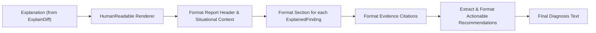

# HumanReadable (`src/presentation/humanreadable`)

The **HumanReadable** module formats structured `Explanation` objects into clean, natural-language diagnostic reports. It serves as the terminal rendering layer in the WhyBroken pipeline.

---

## Purpose

When debugging in terminal sessions, CI logs, or pull request comments, developers need direct, readable answers without JSON formatting, brackets, or enum tags.

HumanReadable provides:
- Clean plain-text formatting of diagnostic findings.
- Automatic assembly of change descriptions, operational impact, and recommended recovery actions.
- Terminal-friendly layout suitable for stdout, PR comments, or incident post-mortems.
- Complete fidelity to upstream evidence with zero generative extrapolation.

---

## How It Works



1. **Input Reception**: Receives an `*explaindiff.Explanation` pointer.
2. **Template Processing**:
   - Formats a clear banner and header displaying context and timestamp.
   - For each finding, renders a numbered section detailing what changed and why it matters.
   - Formats evidence bullets listing specific snapshot hashes and field diffs.
   - If recovery hints are embedded in finding metadata, generates a dedicated `Recommended Action` block.
3. **Packaging**: Returns a `Diagnosis` struct containing the fully rendered string and back-reference IDs.

---

## Key Types

### `humanreadable.HumanReadable`
The presentation renderer:

```go
type HumanReadable struct {
    explanation *explaindiff.Explanation
}

func New(explanation *explaindiff.Explanation) (*HumanReadable, error)
func (hr *HumanReadable) Render() (*Diagnosis, error)
```

### `humanreadable.Diagnosis`
The formatted diagnostic report:

```go
type Diagnosis struct {
    Text          string    `json:"text"`
    ExplanationID string    `json:"explanation_id"`
    Timestamp     time.Time `json:"timestamp"`
}
```

---

## Behavior & Rules

- **Zero Hallucination Guarantee**: The renderer uses strict deterministic Go string formatting. It never uses external LLMs or heuristic guesswork; if a fact is not in the `Explanation`, it does not appear in the text.
- **Traceability Preserved**: The output `Diagnosis` object retains the `ExplanationID` linking back to the raw analysis record.
- **Fail-Safe Formatting**: Nil or empty findings lists render a clean *"No discrepancies detected"* message rather than failing.

---

## Limitations

- Formatting is currently optimized for plain-text terminal output. Rich Markdown and HTML renderers are handled by downstream CLI flags and documentation generators.

---

## CLI Command

- [`repro human-readable`](/cli/operations#human-readable) — render plain language diagnostic report.

```bash
repro human-readable --from snap_01abc --to snap_01xyz
```

---

## See Also

- [ExplainDiff](/modules/explaindiff) — upstream structured explanation provider.
- [WhyBroken](/modules/whybroken) — root-cause analysis engine.
- [Core Concepts: WhyBroken Chain](/concepts/why-broken) — architecture of the explanation pipeline.
