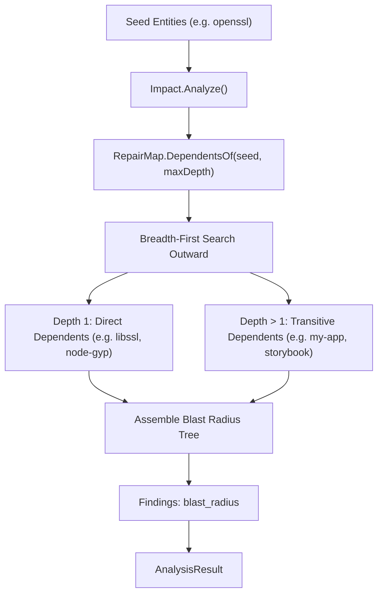

# Impact Analyzer (`src/analysis/impact`)

The **Impact Analyzer** calculates the blast radius of modifying, updating, or removing a set of entities. By traversing the dependency and usage graph outward from target nodes, it identifies all directly and transitively affected components across the system.

---

## Purpose

Before updating a shared library (such as `openssl` or `node`), removing an environment variable, or modifying a core service endpoint, developers and platform engineers need to know:
- *Which services, scripts, and applications depend on this entity?*
- *What is the full downstream cascade of affected components?*
- *Is this change isolated (depth 1) or does it trigger an expansive blast radius?*

Impact Analyzer provides pre-flight risk assessment and post-incident impact mapping using graph traversal.

---

## How It Works



1. **Seed Initialization**: One or more seed entity IDs are provided as the target of the impact evaluation.
2. **Graph Traversal**: The analyzer executes a breadth-first search (BFS) over incoming dependent relations in the `RepairMap`.
3. **Depth Tracking**: Every discovered entity is stamped with its minimum hop distance (`Depth`) from the nearest seed node, as well as the path of entities that led to it.
4. **Classification**:
   - Entities at `Depth == 1` are classified as **Direct Dependents** (`SeverityHigh` if broken).
   - Entities at `Depth > 1` are classified as **Transitive Dependents** (`SeverityMedium`).
5. **Cycle Suppression**: Visited nodes are tracked to prevent loops in circular dependency topologies.

---

## Key Types

### `impact.Impact`
The blast-radius analyzer:

```go
const (
    AnalyzerName    = "impact"
    AnalyzerVersion = "1.0.0"

    FindingTypeBlastRadius = "blast_radius"
)

type ImpactNode struct {
    EntityID entity.ID   `json:"entity_id"`
    Depth    int         `json:"depth"`
    Path     []entity.ID `json:"path"`
}

type ImpactResult struct {
    SeedEntities     []entity.ID             `json:"seed_entities"`
    AffectedEntities map[entity.ID]ImpactNode `json:"affected_entities"`
    TotalAffected    int                     `json:"total_affected"`
    MaxDepthObserved int                     `json:"max_depth_observed"`
}
```

---

## Behavior & Rules

- **Snapshot-Free Operation**: Impact analysis runs entirely against the graph layer; it does not require snapshot storage or file diffs.
- **Configurable Boundary**: The `maxDepth` parameter defaults to `50` hops to guard against pathological graph shapes.
- **Evidence References**: Findings cite `coreanalysis.EvidenceKindGraph` pointing to the exact relation edges traversed.

---

## Limitations

- The fidelity of impact analysis is directly bounded by the completeness of the input graph. If dynamic linkages or external RPC consumers are missing from the graph, they cannot appear in the blast radius.

---

## CLI Command

- [`repro impact`](/cli/operations#impact) — calculate blast radius for entities.

```bash
repro impact --graph ./system-graph.json --entity openssl --max-depth 5
```

---

## See Also

- [RepairMap](/modules/repairmap) — underlying graph query engine.
- [Depspy](/modules/depspy) — undeclared dependency detector.
- [WhyBroken](/modules/whybroken) — utilizes blast radius to grade failure probability.
- [Orphan Analyzer](/modules/orphan) — detects disconnected components.
