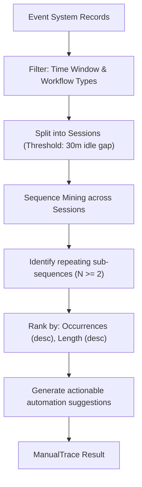

# ManualTrace Workflow Intelligence (`src/intelligence/manualtrace`)

The **ManualTrace** module provides workflow intelligence by analyzing sequences of recorded timeline events. It identifies repetitive, manual command patterns executed by developers and generates concrete automation recommendations (e.g. suggesting Makefile targets, shell aliases, or git shortcuts).

---

## Purpose

Developers frequently repeat the same multi-step rituals manually:
- `npm install` followed immediately by `npm run build` and `npm test`
- `git stash`, `git pull`, then `git stash pop`
- Compiling code, copying binary artifacts, and restarting local daemons

ManualTrace mines the event system to:
- Detect recurring sub-sequences of developer actions across sessions.
- Quantify pattern frequencies and time spent on manual overhead.
- Suggest direct automations (e.g. `"Create a Makefile target 'make ci' to chain these steps"`).

---

## How It Works



1. **Event Ingestion & Filtering**: Reads event records within an optional time range (`--after`, `--before`), discarding background noise to retain workflow-relevant events (command executions, tool runs, config edits).
2. **Sessionization**: Events are partitioned into discrete sessions based on inactivity thresholds (default: 30 minutes of idle time marks a new session).
3. **Pattern Mining**: Scans across sessions to detect repeating sequential subsequences of steps (`Step{EventType, Source}`).
4. **Ranking & Suggestions**: Patterns observed at least twice are ranked by occurrence count and sequence length. Heuristic rules match recognized patterns to actionable automation advice.

---

## Key Types

### `manualtrace.ManualTrace`
The pattern analysis runner:

```go
type ManualTrace struct {
    events []*event.Event
}

func New(events []*event.Event) (*ManualTrace, error)
func (mt *ManualTrace) Analyze() (*Result, error)
```

### Result & Pattern Types
```go
type Step struct {
    EventType event.Type   `json:"event_type"`
    Source    event.Source `json:"source"`
    Subject   string       `json:"subject,omitempty"`
}

type Pattern struct {
    Steps       []Step        `json:"steps"`
    Occurrences int           `json:"occurrences"`
    EventIDs    [][]event.ID  `json:"event_ids"`
    Suggestion  string        `json:"suggestion"`
}

type Result struct {
    Module        string    `json:"module"`
    Version       string    `json:"version"`
    Timestamp     time.Time `json:"timestamp"`
    Patterns      []Pattern `json:"patterns"`
    EventsScanned int       `json:"events_scanned"`
    Sessions      int       `json:"sessions"`
}
```

---

## Behavior & Rules

- **Deterministic Sequencing**: Sequences are identified using canonical keys (`s.EventType + ":" + s.Source`), ensuring stable pattern matching regardless of minor timestamp variations.
- **Evidence Trail**: Each occurrence in a `Pattern` stores the exact list of `event.ID` references that formed the sequence.
- **Noise Resistance**: Lone single-event occurrences are omitted; only multi-step or recurring patterns appear in results.

---

## Limitations

- ManualTrace requires events to be recorded in the Event System. If commands were executed outside Repro's tracked environment, they cannot be analyzed.

---

## CLI Command

- [`repro manual-trace`](/cli/operations#manual-trace) — scan event records for repetitive sequences.

```bash
repro manual-trace --after "2026-10-01T00:00:00Z"
```

---

## See Also

- [Snapshot Engine](/modules/engine) — snapshot storage and timeline queries.
- [Central Store](/modules/central) — project registration and event persistence.
- [Watchdog](/modules/watchdog) — records events from file and environment activity.
