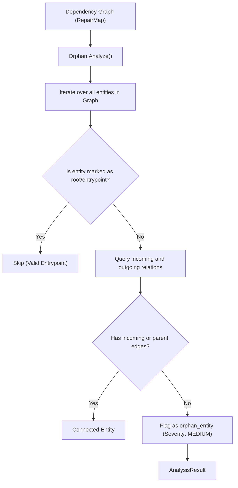

# Orphan Analyzer (`src/analysis/orphan`)

The **Orphan Analyzer** identifies unowned, disconnected, and unreferenced resources across a project's dependency graph. Unlike DeadConfig (which focuses on settings), Orphan scans across all entity kinds—including libraries, scripts, binaries, and services.

---

## Purpose

Large development repositories accumulate abandoned artifacts: utility scripts created for a one-off migration and forgotten, packages installed for tests that were deleted, or orphaned plugins that are no longer part of any build pipeline.

Orphan Analyzer provides:
- Automated discovery of completely disconnected graph entities.
- Distinguishing intentional root entrypoints from genuinely abandoned components.
- Cleanup recommendations backed by graph topology evidence.

---

## How It Works



1. **Entity Enumeration**: Queries the `RepairMap` for all registered entities across all kinds.
2. **Root Filtering**: Skips entities marked with entrypoint flags or root roles (such as primary application binaries or top-level project definitions).
3. **Relation Inspection**: Evaluates both incoming (`dependents`) and parent ownership edges.
4. **Orphan Flagging**: Any non-root entity with zero incoming relations is tagged as an orphan finding (`orphan_entity`).

---

## Key Types

### `orphan.Orphan`
The graph orphan detector:

```go
const (
    AnalyzerName    = "orphan"
    AnalyzerVersion = "1.0.0"

    FindingTypeOrphan = "orphan_entity"
)

type Orphan struct {
    repairMap *repairmap.RepairMap
}

func New(rm *repairmap.RepairMap) (*Orphan, error)
func (o *Orphan) Name() string
func (o *Orphan) Version() string
func (o *Orphan) Analyze() (*coreanalysis.AnalysisResult, error)
```

---

## Behavior & Rules

- **Root Exception**: Entities with `kind == "application"` or explicitly tagged with root attributes are never marked as orphans.
- **Severity Rating**: Orphan findings default to `SeverityMedium` because disconnected artifacts inflate repository size, confuse maintenance, and may introduce security risks.
- **Evidence Binding**: Findings attach `coreanalysis.EvidenceKindGraph` pointing to the isolated entity record.

---

## Limitations

- Does not track historical creation time; for time-based disappearance and abandoned file lifecycles, combine with the [GhostFile](/modules/ghostfile) analyzer.

---

## CLI Command

- [`repro orphan`](/cli/operations#orphan) — detect disconnected and unreferenced entities.

```bash
repro orphan --graph ./system-graph.json
```

---

## See Also

- [DeadConfig](/modules/deadconfig) — specialized orphan detector for configuration keys.
- [GhostFile](/modules/ghostfile) — combines history and graph to detect abandoned files.
- [RepairMap](/modules/repairmap) — graph storage and adjacency index.
