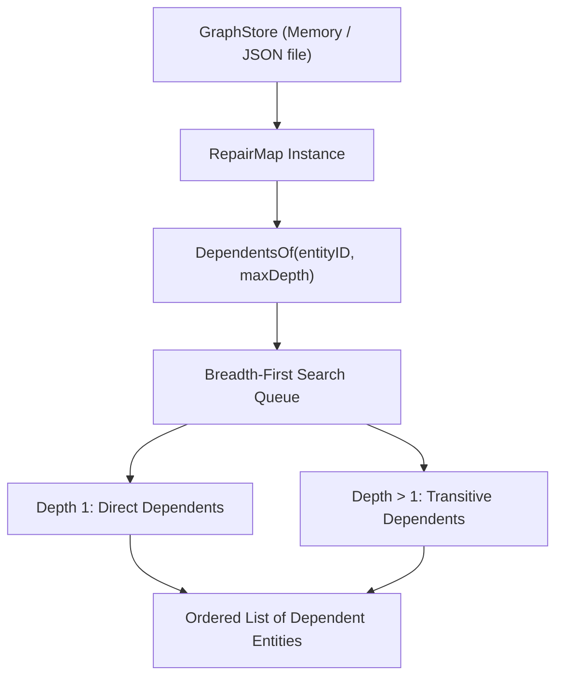

# RepairMap (`src/graph/repairmap`)

The **RepairMap** module provides graph indexing, querying, and traversal capabilities for software components, configurations, and system resources. It powers structural impact analysis, root-cause confidence grading, and orphan resource detection.

---

## Purpose

Understanding system health requires knowing not just what changed, but what *relies* on what changed. A flat snapshot diff tells you that `openssl` was updated, but only a graph query can answer: *"Which running microservices and native modules are linked to this library?"*

RepairMap is used to:
- Index software entities and directed relations (`depends_on`, `imports`, `configures`, `owns`).
- Traverse dependent trees outward via breadth-first search (BFS).
- Grade confidence in root-cause detection (WhyBroken upgrades finding confidence when a changed entity has direct or transitive links to a broken component).
- Query immediate upstream dependencies and downstream dependents.

---

## How It Works



1. **Graph Indexing**: Entities and relations are indexed into in-memory adjacency maps (`outgoing` and `incoming` edge buckets).
2. **Directional Traversal**:
   - `DependenciesOf(id)` queries outgoing edges (`A -> B`: A depends on B).
   - `DependentsOf(id, maxDepth)` queries incoming edges (`B <- A`: A is impacted if B breaks) using BFS with cycle detection.
3. **Filtering**: Entities and relations can be selected using `graph.Filter` criteria (matching by Kind, Name, or Attribute key-values).

---

## Key Types

### `repairmap.RepairMap`
The primary graph query service:

```go
type RepairMap struct {
    store store.Store
}

func New(store store.Store) *RepairMap
func (rm *RepairMap) DirectDependencies(id entity.ID) ([]entity.Entity, error)
func (rm *RepairMap) DirectDependents(id entity.ID) ([]entity.Entity, error)
func (rm *RepairMap) DependentsOf(id entity.ID, maxDepth int) ([]entity.Entity, error)
func (rm *RepairMap) ListEntities(filter graph.Filter) ([]entity.Entity, error)
func (rm *RepairMap) AllRelationsFor(id entity.ID) ([]relation.Relation, error)
func (rm *RepairMap) AddEntity(e entity.Entity) error
func (rm *RepairMap) AddRelation(r relation.Relation) error
```

### Graph Entities & Relations
Core domain representations:

```go
type Entity struct {
    ID         entity.ID      `json:"id"`
    Kind       entity.Kind    `json:"kind"`
    Name       string         `json:"name"`
    Attributes map[string]any `json:"attributes,omitempty"`
}

type Relation struct {
    ID         relation.ID       `json:"id"`
    Kind       relation.Kind     `json:"kind"`
    From       entity.ID         `json:"from"`
    To         entity.ID         `json:"to"`
    Attributes map[string]any    `json:"attributes,omitempty"`
}
```

---

## Behavior & Rules

- **Cycle Protection**: Graph traversals maintain an internal `visited` map to prevent infinite loops on circular dependencies.
- **Depth Limiting**: The `maxDepth` parameter bounds traversal radius (defaults to `50` when unspecified).
- **Referential Integrity**: An edge can only be added if both `From` and `To` entity identifiers exist in the graph store.
- **Confidence Upgrading in WhyBroken**:
  - `linkSelf`: The broken component *is* the modified entity (`ConfidenceConfirmed`).
  - `linkDirect`: The broken component directly depends on the modified entity (`ConfidenceLikely`).
  - `linkTransitive`: The broken component transitively depends on the modified entity (`ConfidencePossible`).

---

## Limitations

- Graph operations are performed in memory; extremely large graphs (> 100,000 entities) should be partitioned by subsystem.

---

## CLI Command

- [`repro repair-map`](/cli/analysis#repair-map) — query dependency relationships.

```bash
repro repair-map --graph ./system-graph.json --subject openssl
```

---

## See Also

- [Depspy](/modules/depspy) — undeclared dependency detector.
- [Impact](/modules/impact) — blast radius analyzer using RepairMap traversal.
- [WhyBroken](/modules/whybroken) — root-cause engine utilizing RepairMap link grading.
- [Orphan](/modules/orphan) — unreferenced resource detector.
