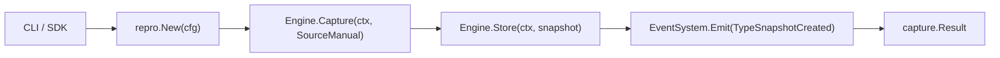

# Repro Capture (`src/capture/repro`)

The **Repro Capture** module provides the explicit, one-shot manual capture mechanism. It wraps the low-level Snapshot Engine, attaches operational metadata, links parent lineage, and automatically emits life-cycle audit events into the Event System.

---

## Purpose

Developers frequently need to take deliberate baselines before and after making risky environment modifications—such as upgrading compiler versions, running database migrations, or testing experimental dependency updates.

Repro Capture is designed for:
- One-shot baseline creation initiated directly by developer commands or CI build steps.
- Creating parent-linked snapshots to establish an explicit progression chain.
- Emitting standard `snapshot_created` events into the timeline for historical traceability.

---

## How It Works



1. **Option Processing**: Options such as `WithReason`, `WithParent`, `WithLabel`, and collector filters are parsed.
2. **Snapshot Creation**: The Snapshot Engine is invoked with source set to `snapshot.SourceManual`.
3. **Persistence**: The snapshot record is committed to the configured store.
4. **Event Emission**: If an `EventSystem` is wired, a `TypeSnapshotCreated` event is emitted containing the snapshot ID, reason, and label metadata.
5. **Result Packaging**: A `capture.Result` struct containing both the snapshot pointer and generated events is returned.

---

## Key Types

### `repro.Repro`
The manual capture runner:

```go
type Repro struct {
    cfg *capture.Config
}

func New(cfg *capture.Config) (*Repro, error)
func (r *Repro) Capture(ctx context.Context, opts ...Option) (*capture.Result, error)
```

### `capture.Result`
The aggregated output returned from capture operations:

```go
type Result struct {
    Snapshot *snapshot.Snapshot
    Events   []*event.Event
    Error    error
}
```

### Functional Options
```go
func WithReason(reason string) Option
func WithParent(parentID snapshot.ID) Option
func WithLabel(key, value string) Option
func WithCollectors(collectors ...string) Option
```

---

## Behavior & Rules

- **Source Attribution**: All snapshots produced by this module are stamped with `snapshot.SourceManual`.
- **Decoupled Event System**: If `EventSystem` is `nil` in the capture configuration, the snapshot is still captured and stored successfully without error; event emission is simply skipped.
- **Fail-Fast Validation**: If the target storage directory is read-only or invalid collector names are provided, an error is returned immediately before state capture proceeds.

---

## Limitations

- Repro Capture is strictly a one-shot operation. It does not schedule background tasks or maintain long-lived polling loops.
- Snapshot lineage requires explicitly passing `--parent` or relying on CLI auto-detection of the latest ancestor.

---

## CLI Command

- [`repro capture`](/cli/capture#capture) — primary manual capture command.

```bash
repro capture --reason "pre-upgrade baseline" --label "stage=dev"
```

---

## See Also

- [Snapshot Engine](/modules/engine) — underlying collection and persistence engine.
- [TimeCapsule](/modules/timecapsule) — periodic, daemon-based environment capture.
- [Watchdog](/modules/watchdog) — event-driven reactive capture trigger.
- [Core Concepts: Snapshots](/concepts/snapshots) — snapshot and event semantics.
