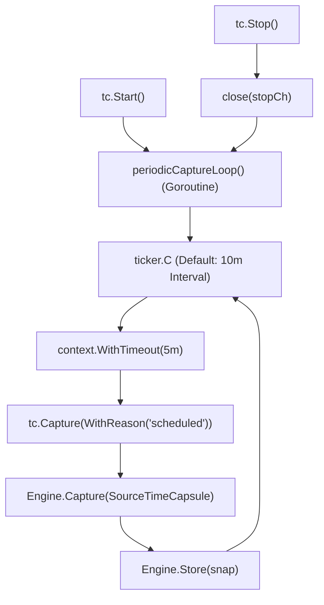

# TimeCapsule (`src/capture/timecapsule`)

The **TimeCapsule** module provides automated, periodic environment state capture. Operating as a background daemon or scheduled service, it records snapshots at regular intervals to establish an unbroken timeline of environment evolution.

---

## Purpose

Unnoticed changes—such as auto-updating background package managers, expired certificates, system daemon updates, or silent configuration mutations—often cause subtle breakages hours or days after they occur.

TimeCapsule addresses this by:
- Capturing scheduled snapshots on a recurring ticker without requiring developer manual intervention.
- Ensuring a continuous progression history is available for time-series drift detection and timeline forensics.
- Operating unobtrusively with bounded per-capture timeouts so that background captures never hang development workflows.

---

## How It Works



1. **Lifecycle Management**: Calling `Start()` initializes a `time.Ticker` and launches the `periodicCaptureLoop` in an independent goroutine.
2. **Interval Ticking**: At each tick (default: 10 minutes), a 5-minute timeout context is initialized to bound resource consumption.
3. **Capture Execution**: A snapshot is gathered via the Snapshot Engine tagged with `snapshot.SourceTimeCapsule`.
4. **Resilient Error Handling**: Errors during periodic ticks (e.g. temporary disk contention) are logged and non-fatal, allowing the schedule loop to persist.
5. **Clean Shutdown**: `Stop()` or `Close()` signals the `stopCh` channel, stops the ticker, and resets internal state safely.

---

## Key Types

### `timecapsule.TimeCapsule`
The periodic capture scheduler:

```go
type TimeCapsule struct {
    cfg           *capture.Config
    interval      time.Duration
    ticker        *time.Ticker
    stopCh        chan struct{}
    running       bool
    lastCaptureID snapshot.ID
    mu            sync.RWMutex
}

func New(cfg *Config) (*TimeCapsule, error)
func (tc *TimeCapsule) Start() error
func (tc *TimeCapsule) Stop() error
func (tc *TimeCapsule) IsRunning() bool
func (tc *TimeCapsule) LastCaptureID() snapshot.ID
func (tc *TimeCapsule) Capture(ctx context.Context, opts ...Option) (*capture.Result, error)
func (tc *TimeCapsule) Close() error
```

### `timecapsule.Config`
Configuration parameters for TimeCapsule:

```go
type Config struct {
    Capture   *capture.Config
    Interval  time.Duration
    AutoStart bool
}
```

---

## Behavior & Rules

- **Thread-Safe State**: All lifecycle transitions (`Start`, `Stop`, `Close`, `IsRunning`) are guarded by an internal read-write mutex (`sync.RWMutex`).
- **Idempotency Safeguards**: Attempting to call `Start()` when already running returns `capture.ErrAlreadyRunning`; calling `Stop()` when inactive returns `capture.ErrNotRunning`.
- **Source Marker**: Snapshots produced during periodic sweeps use `snapshot.SourceTimeCapsule`.
- **Manual Override**: Callers can still invoke `tc.Capture(ctx)` directly on a running or stopped instance to force an immediate capture without resetting the ticker.

---

## Limitations

- TimeCapsule runs in-process. In CLI mode without an external process supervisor (systemd, launchd, or container manager), terminating the CLI process terminates the capture loop.
- Default capture interval is 10 minutes; intervals under 30 seconds are discouraged due to disk I/O overhead on large repositories.

---

## CLI Command

- [`repro capture --mode periodic`](/cli/capture#capture) — launch capture with periodic scheduling.

```bash
repro capture --mode periodic
```

---

## See Also

- [Snapshot Engine](/modules/engine) — snapshot creation and hashing layer.
- [Repro Capture](/modules/repro) — manual one-shot capture.
- [Watchdog](/modules/watchdog) — reactive event-triggered capture.
- [Drift Analyzer](/modules/drift) — analyze deviation over time across TimeCapsule snapshots.
