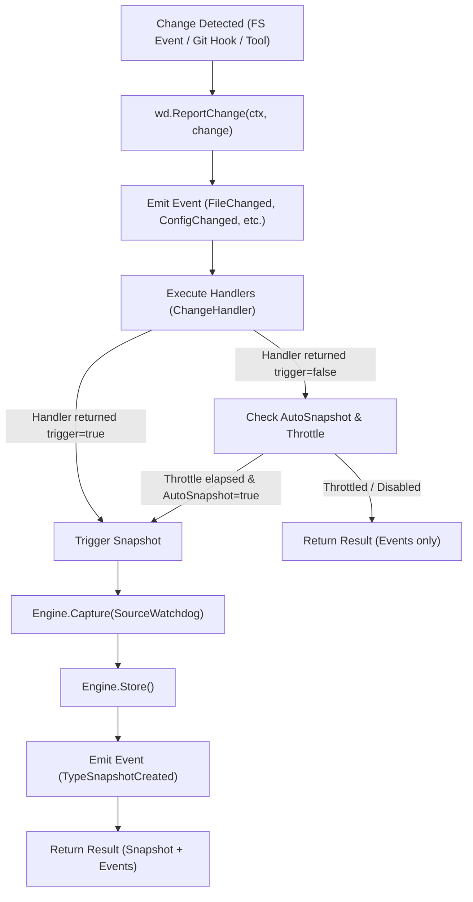

# Watchdog (`src/capture/watchdog`)

The **Watchdog** module provides reactive, event-driven state capture. It monitors development environments for discrete mutation signals—such as file changes, configuration modifications, package installations, and git commits—emitting timeline events and conditionally triggering state snapshots.

---

## Purpose

Polling periodically with TimeCapsule is effective for background tracking, but developers often make rapid changes that break things between scheduled intervals. 

Watchdog provides:
- Immediate detection of discrete filesystem and environment modifications.
- Emission of granular timeline events without requiring a full snapshot for every minor touch.
- Throttled automatic snapshot generation so that rapid file-saving sprees do not exhaust storage or CPU resources.
- Pluggable change handlers to let developers decide exactly what conditions warrant snapshot persistence.

---

## How It Works



1. **Change Ingestion**: An external source invokes `ReportChange(ctx, change)` with a typed `Change` payload.
2. **Timeline Event Record**: The change is mapped to a canonical `event.Type` and immediately stored in the Event System.
3. **Trigger Evaluation**:
   - Custom `ChangeHandler` functions are evaluated. If any handler indicates a snapshot is required, the trigger flag is set.
   - If no handler triggers and `AutoSnapshot` is enabled, the elapsed duration since the last snapshot is checked against `Throttle`.
4. **Snapshot Capture**: If triggered, `Engine.Capture(ctx, SourceWatchdog)` is executed, the snapshot is persisted, and a follow-up `snapshot_created` event is recorded.

---

## Key Types

### `watchdog.Watchdog`
The watchdog monitor and trigger coordinator:

```go
type Watchdog struct {
    cfg          *capture.Config
    handlers     []ChangeHandler
    autoSnapshot bool
    throttle     time.Duration
    lastSnapshot time.Time
    running      bool
    stopCh       chan struct{}
    mu           sync.RWMutex
}

func New(cfg *Config) (*Watchdog, error)
func (wd *Watchdog) ReportChange(ctx context.Context, change *Change) (*capture.Result, error)
func (wd *Watchdog) AddHandler(handler ChangeHandler)
func (wd *Watchdog) Start() error
func (wd *Watchdog) Stop() error
func (wd *Watchdog) IsRunning() bool
func (wd *Watchdog) Close() error
```

### `watchdog.Change` & `watchdog.ChangeType`
The change representation fed into Watchdog:

```go
type ChangeType string

const (
    ChangeTypeFileModified  ChangeType = "file_modified"
    ChangeTypeFileCreated   ChangeType = "file_created"
    ChangeTypeFileDeleted   ChangeType = "file_deleted"
    ChangeTypeEnvChanged    ChangeType = "env_changed"
    ChangeTypeConfigChanged ChangeType = "config_changed"
    ChangeTypePackageChange ChangeType = "package_changed"
    ChangeTypeRuntimeChange ChangeType = "runtime_changed"
    ChangeTypeGitCommit     ChangeType = "git_commit"
    ChangeTypeUnknown       ChangeType = "unknown"
)

type Change struct {
    Type      ChangeType
    Subject   string
    Timestamp time.Time
    Metadata  map[string]any
}

type ChangeHandler func(ctx context.Context, change *Change) (triggerSnapshot bool, err error)
```

---

## Behavior & Rules

- **Event Separation Principle**: Changes *always* produce an `Event`, but only *conditionally* trigger a `Snapshot`. Events are lightweight peers, not children of snapshots.
- **Throttling Protection**: When `AutoSnapshot` is active, `Throttle` (e.g. 30 seconds) prevents multiple file modifications within the same burst from generating redundant snapshot records.
- **Handler Isolation**: An error returned by a custom `ChangeHandler` is logged and non-fatal; other handlers in the chain continue execution.
- **Source Stamp**: Snapshots initiated by this module receive `snapshot.SourceWatchdog`.

---

## Limitations

- The core Watchdog module provides change ingestion, evaluation, and snapshot orchestration. OS-level filesystem event watching (e.g., via `inotify` or `kqueue`) is bridged via CLI flags or external file-watcher integrations calling `ReportChange`.

---

## CLI Command

- [`repro capture --mode watch`](/cli/capture#capture) — start capture in watchdog monitor mode.

```bash
repro capture --mode watch
```

---

## See Also

- [Snapshot Engine](/modules/engine) — snapshot storage and normalization.
- [Repro Capture](/modules/repro) — manual one-shot capture.
- [TimeCapsule](/modules/timecapsule) — periodic capture scheduler.
- [WhyBroken](/modules/whybroken) — correlates Watchdog events with snapshot diffs to find root causes.
