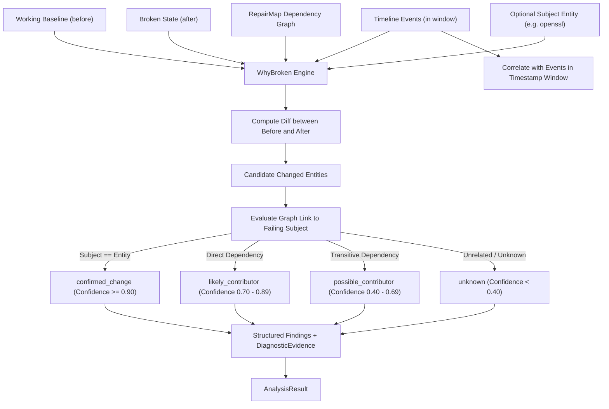

# WhyBroken Root-Cause Engine (`src/analysis/whybroken`)

The **WhyBroken** engine is Repro's premier automated diagnostic analyzer. It answers the fundamental engineering question: *"It worked yesterday. What changed, and why did it break?"*

---

## Purpose

Traditional debugging forces engineers to manually correlate git commit logs, shell histories, package diffs, and compiler errors. Often, changes that happened close in time to an error are falsely blamed (the *post hoc ergo propter hoc* fallacy).

WhyBroken solves this by:
- Correlating pairwise state diffs, timeline event sequences, and dependency graph topologies.
- Strictly separating operational **severity** (impact) from forensic **confidence** (certainty).
- Enforcing the rule that temporal proximity *alone* never yields confirmed or likely causality.
- Providing evidence-backed findings ready for narrative formatting in ExplainDiff.

---

## How It Works



1. **State Diffing**: BeforeAfter diffing determines all entities added, removed, or modified between the baseline and broken snapshots.
2. **Event Correlation**: Events recorded within the interval between snapshots are scanned for matching entity identifiers or error triggers.
3. **Graph Distance Evaluation**:
   - If a `--subject` entity is specified (the component failing the build or test), the distance in the `RepairMap` between candidate changes and the subject is computed.
   - `linkSelf`: The modified entity is the failing subject itself.
   - `linkDirect`: The subject directly imports or depends on the modified entity.
   - `linkTransitive`: The subject reaches the modified entity via transitive dependencies.
   - `linkNone`: No topological path exists.
4. **Confidence Assignment**:
   - `confirmed_change`: Strong direct forensic evidence (e.g. ABI mismatch on direct dependency).
   - `likely_contributor`: Direct graph linkage combined with matching timeline events.
   - `possible_contributor`: Transitive graph linkage or unverified correlation.
   - `unknown`: Changes without verifiable connection to the failure.

---

## Key Types

### `whybroken.WhyBroken`
The root-cause engine:

```go
const (
    AnalyzerName    = "whybroken"
    AnalyzerVersion = "1.0.0"

    FindingTypeConfirmedChange     = "confirmed_change"
    FindingTypeLikelyContributor   = "likely_contributor"
    FindingTypePossibleContributor = "possible_contributor"
    FindingTypeUnknown             = "unknown"
)

type WhyBroken struct {
    repairMap *repairmap.RepairMap
    before    *snapshot.Snapshot
    after     *snapshot.Snapshot
    events    []*event.Event
    subject   entity.ID
}

func New(rm *repairmap.RepairMap, before, after *snapshot.Snapshot, events []*event.Event, opts ...Option) (*WhyBroken, error)
func WithSubject(id entity.ID) Option
func (w *WhyBroken) Name() string
func (w *WhyBroken) Version() string
func (w *WhyBroken) Analyze() (*coreanalysis.AnalysisResult, error)
```

---

## Behavior & Rules

- **Strict Invariant**: Time proximity alone *never* upgrades a finding to `confirmed_change` or `likely_contributor`. Evidence must demonstrate structural graph connectivity or direct runtime linkage.
- **Independent Axes**: A finding can have `SeverityCritical` with `ConfidenceLow` (e.g. an unverified kernel patch) or `SeverityLow` with `ConfidenceConfirmed` (e.g. a confirmed minor documentation edit).
- **Mandatory Evidence**: Every generated finding includes at least one `DiagnosticEvidence` object citing snapshot diffs, graph relations, or event IDs.

---

## Limitations

- WhyBroken requires both baseline and broken snapshots. If only a broken snapshot exists without a prior baseline, pairwise diffing cannot run.

---

## CLI Command

- [`repro why-broken`](/cli/operations#why-broken) — automated evidence-backed root cause analysis.

```bash
repro why-broken --from snap_01abc --to snap_01xyz --subject openssl
```

---

## See Also

- [ExplainDiff](/modules/explaindiff) — structures WhyBroken findings into evidence-cited explanations.
- [HumanReadable](/modules/humanreadable) — renders explanations into natural language.
- [RepairMap](/modules/repairmap) — graph topology provider.
- [Core Concepts: WhyBroken Chain](/concepts/why-broken) — deep dive into diagnostic confidence principles.
